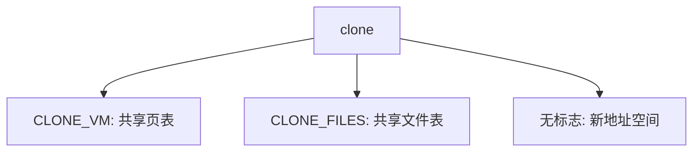

# clone 标志

fork 是一份固定的共享清单；clone 用标志位选择与父共享地址空间、文件表还是命名空间，从而把进程和线程做成同一原语的两端。

<footer>—— 据 Love, Linux Kernel Development；Bovet and Cesati 整理</footer>

[上一课](/cs/thread-tls)给出每线程 TLS。[fork](/cs/fork) 几乎复制一切（文件表除外常共享引用）。缺口是更细的创建：**clone**——调用者选择与父共享 `mm`、文件、信号、命名空间中的哪几项。POSIX 线程创建在 Linux 上就是带 `CLONE_VM` 等标志的 clone。本课只钉标志的语义轴，不把每个 `CLONE_*` 位背完。

## 问题

若内核同时维持 `fork` 与 `thread_create` 两套完全不同的路径，共享与复制规则会分叉。统一成 clone：新 PCB 必有，标志决定指针是共享还是深拷。`CLONE_VM`：同页表，即线程。不设：新地址空间，即进程。`CLONE_FILES`：同文件表。缺口不是 TLS 布局，而是这份**资源共享菜单**。

命名空间标志（PID、mount、net）把「容器」做成 clone 的极端：看起来像进程，看见的是另一套名字。隔离策略是更后的课，本课只承认位存在。

## 方法

系统调用：分配 PCB 与内核栈，按位挂接或复制 `mm`、`fs`、`files`、`sighand`。父与子的返回值约定类似 fork（或通过ptid/ctid 写出 tid）。用户库把「创建线程」译成一组固定位 + 新栈 + 新 TLS。错误则不留下半共享的对象。

与[进程组](/cs/process-groups)的交界：线程组（`CLONE_THREAD`）共享 TGID，wait 的是组而不是每个 tid——点到即可。

## 机制

标志把「进程 vs 线程」从类型变成配置。调度器仍看见一个个 `task_struct`；是否换页表根在切换时看 `mm` 指针是否相同。用户若错误组合（共享 vm 却不共享信号手），语义古怪，库不会那样做。主干只要求：共享 vm ⇒ 同进程线程模型。

## 边界

本课不把 seccomp 与 clone 的组合写成攻击面，不讨论用户命名空间的全部能力下落。也不把 `clone3` 的结构体扩展当新哲学。FPU 与内核栈尚未单独成课：下一课先把切换时那条内核栈钉死。

后课默认：创建用 clone 菜单。CPU 从一条任务换到另一条时保存什么、换什么，下一课讲[上下文切换](/cs/context-switch)。

## 小结

- clone 用标志选择共享 mm、文件、信号等；线程是共享 vm 的一端。
- 每个 clone 仍是一个可调度 PCB。
- 如何把 CPU 交给另一条任务，下一课上下文切换。
- 出处：Love, *LKD*；Bovet and Cesati。
