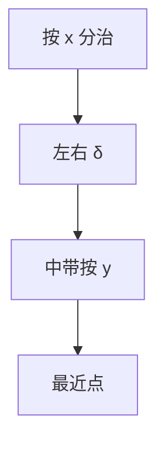

# 最近点对

平面最近点对可分治：$O(n\log n)$ 排序后，中线带宽内最多常数个候选，总 $T(n)=2T(n/2)+O(n)$。

<footer>—— 据 Shamos and Hoey, Closest-Point Problems, 1975；CLRS 第 33.4 节整理</footer>

上一课[扫描线](/cs/sweep-line)处理覆盖。最近点对：$\min_{i\neq j}\|p_i-p_j\|$。朴素 $O(n^2)$。缺口是分治：按 $x$ 中位数切开，带宽 $\delta$ 内按 $y$ 扫。不重写卡壳直径（那是最远）。后课线段相交。

## 问题

左右各递归得 $\delta$。中线 $x$ 附近宽度 $2\delta$ 的点按 $y$ 排序（可归并）。每个点只与其后常数个（网格论证至多 7）比较。$O(n\log n)$。

扫描线：平衡树按 $y$ 维护距左 $\delta$ 的点，同样 $O(n\log n)$。

缺口是带宽常数候选，不是旋转卡壳。

### 最远点对不是本课

最远在凸包直径。最近点通常在内部。不要混。

Shamos–Hoey 1975。CLRS 33.4。后课 BO 线段交。

## 方法

预排序 $x$。分治归并 $y$。或扫描 + 树。注意重合点距离 0。

三维类似但带宽候选不再常数级同样简单。

## 机制

鸽笼：$\delta\times\delta$ 方格里至多一点来自一侧最优，故沿 $y$ 常数邻居。与主定理：$O(n\log n)$。与哈希网格期望线性点名。

## 边界

本课不写高维最近点的 $n^{1+\varepsilon}$。动态最近点不写。后课默认：平面最近点对 $O(n\log n)$。下一课 Bentley–Ottmann。

## 小结

- 分治中带常数比较。
- $O(n\log n)$；最远走凸包。
- 扫描线变体同类。
- 出处：Shamos and Hoey, 1975；CLRS 第 33.4 节。
