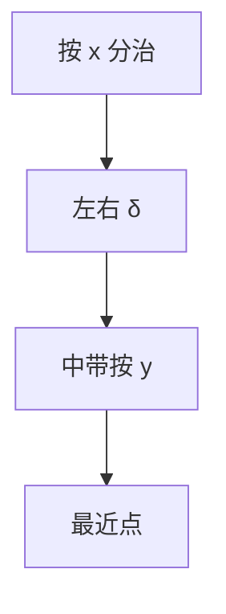
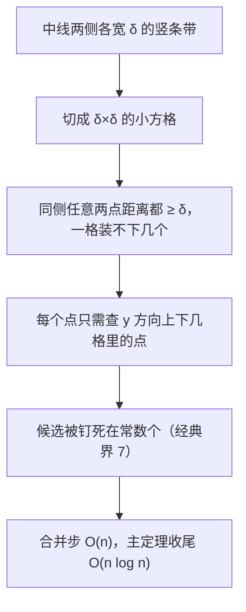

# 最近点对

平面最近点对可分治：$O(n\log n)$ 排序后，中线带宽内最多常数个候选，总 $T(n)=2T(n/2)+O(n)$。

<footer>—— 据 Shamos and Hoey, Closest-Point Problems, 1975；CLRS 第 33.4 节整理</footer>

上一课[扫描线](/cs/sweep-line)处理覆盖问题。现在要最近点对 $\min_{i\neq j}\|p_i-p_j\|$：朴素两两比较是 $O(n^2)$。缺口是分治：按 $x$ 中位数切开，两侧各递归出 $\delta$，再只扫中线附近带宽 $2\delta$ 的竖条。本课不重写旋转卡壳（那是最远点对）；后课线段相交。

## 问题

左右各递归得 $\delta=\min(\delta_L,\delta_R)$；把中线附近宽 $2\delta$ 的点按 $y$ 归并排序；条内每个点只与 $y$ 序后继的常数个点比较——格论证说至多 7 个。总式 $T(n)=2T(n/2)+O(n)$，即 $O(n\log n)$。数字实例：$n=100$ 万个点，朴素两两比较约要做 $10^{12}$ 次距离计算；$O(n\log n)$ 大约是 $10^6 \times 20 = 2\times 10^7$ 次——差五个数量级，这就是「中带常数候选」这一论证换来的收益。

扫描线：平衡树按 $y$ 维护距左 $\delta$ 的点，同样 $O(n\log n)$。

缺口是「带宽内常数候选」这个论证，不是旋转卡壳。

### 最远点对不是本课

最远点对住在凸包直径上，用旋转卡壳求；最近点对通常在内部，与凸包无关。不要混。

Shamos–Hoey 1975。CLRS 33.4。后课 BO 线段交。

## 方法

实现：先按 $x$ 预排序；递归用归并维持 $y$ 序，免得每层重新排序；或者一上手就扫描线加按 $y$ 组织的平衡树，$\delta$ 收紧时顺手删掉离扫描线超 $\delta$ 的点。注意重合点：距离为 $0$，先判重。常见误区：直接写递归、每层重新排序——单层就付 $O(n\log n)$，总复杂度退回 $O(n\log^2 n)$。正确姿势是递归时用归并把 $y$ 序「顺手」合并出来；另外开口先判重合点，否则两个重合点会让答案平凡地是 0，程序却可能还在条带里白忙。

```mermaid
flowchart TD
  X["按 x 分治"] --> D["左右 δ"]
  D --> STR["中带按 y"]
  STR --> NN["最近点"]
```

三维以上仍可分治：中带内的候选对仍被常数上限截住，只是常数随维数变大，实现也更繁。

## 机制

机制是鸽笼论证：把条带切成 $\delta\times\delta$ 的方格，任一方格里同侧至多一点——否则该侧两点距离已 $\lt\delta$，矛盾；于是每个点沿 $y$ 方向至多与常数个点可能成对，线性合并步保住了。配主定理得 $O(n\log n)$。随机哈希网格（点撒进格子、只查邻格）期望线性，点名。

```mermaid
flowchart TD
  STRIP["中线两侧各宽 δ 的竖条带"] --> GRID["切成 δ×δ 的小方格"]
  GRID --> CAGE["同侧任意两点距离都 ≥ δ，一格装不下几个"]
  CAGE --> CAND["每个点只需查 y 方向上下几格里的点"]
  CAND --> CONST["候选被钉死在常数个（经典界 7）"]
  CONST --> LIN["合并步 O(n)，主定理收尾 O(n log n)"]
```

这张图回答「为什么条带里不会冒出海量候选」。直觉类比鸽笼论证：格子里若塞进两个同侧点，它俩的距离必然小于格子尺寸，与「同侧点至少相距 δ」矛盾——每格几乎独占，候选才恒为常数。这一步是整个 $O(n\log n)$ 的承重墙。

## 边界

本课不写高维最近点的复杂度阶梯，不写带插入删除的动态最近点。后课默认：平面最近点对 $O(n\log n)$。下一课 Bentley–Ottmann。

## 小结

- 分治中带常数比较。
- $O(n\log n)$；最远走凸包。
- 扫描线变体同类。
- 出处：Shamos and Hoey, 1975；CLRS 第 33.4 节。
