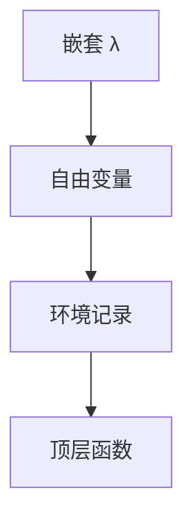

# 闭包转换与 lambda 提升

嵌套函数要变成顶层函数加环境参数。闭包转换把自由变量打成记录；lambda lifting 把自由变量变成额外形参。

<footer>—— 据 Johnsson, Lambda Lifting；Appel, Compiling with Continuations；Peyton Jones 整理</footer>

上一课[弱引用](/cs/weak-refs-finalizers) 收束堆。语言特性落地：表面有嵌套 λ。[λ 演算](/cs/lambda-calculus) 的自由变量在实现里要有家。缺口是 **closure conversion / lifting**。CPS 下一课。不重写 β。

## 问题

`λx. ... y ...` 的 $y$ 来自外层。机器没有嵌套作用域。转换：`λ(env,x). ... env.y`，调用处传闭包指针。缺口是**环境表示**（扁平记录、链），不是 GC 弱。

提升：把 $y$ 变成参数，调用处传递，适合已知调用点；做成闭包值则必须堆记录。

### 闭包不是 C 函数指针

函数指针无环境。带环境的是胖指针 `{code, env}`。C++ `std::function`、Rust 闭包各有表示。

Johnsson 1985。Appel CWC。Peyton Jones 实现书。与[逃逸](/cs/escape-analysis)：环境未逃逸可栈上。

## 方法

算自由变量。选表示：逃逸则堆闭包。生成顶层函数。调用：间接 `code(env, args)`。已知闭包+内联则可消间接。

与所有权：环境捕获是移动还是借用，接 Rust 课。与 RC：环境字段要计数。

## 机制

链式环境：共享外层，可变捕获麻烦。扁平：复制，可变要盒。不要捕获后还以为外层栈槽活着——悬空，生命周期课已禁。

优化：已知函数、无自由变量则退化成函数指针。

## 边界

本课不写 CPS。后课默认：嵌套函数降为闭包或提升参数。下一课 CPS 与延续。

也不把闭包当数学闭包算子。

## 小结

- 闭包转换：代码+环境；lifting：自由变量变参数。
- 表示受逃逸与可变捕获约束。
- 无自由变量则退化为函数指针。
- 出处：Johnsson；Appel CWC；Peyton Jones。
