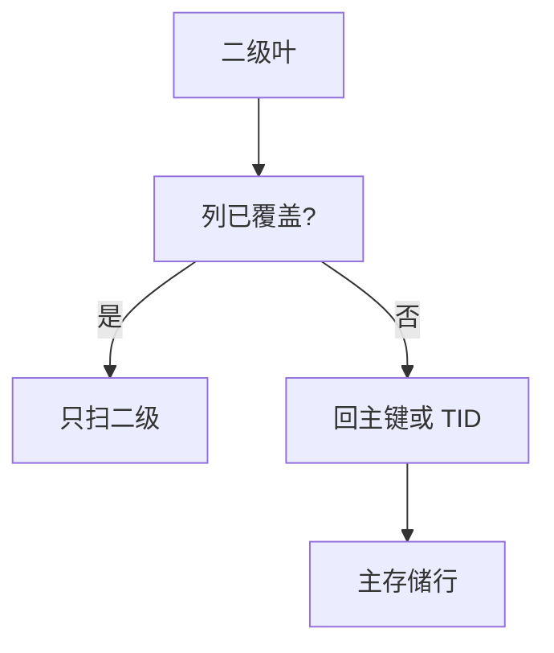

# 聚簇索引与回表

二级索引命中后要回主存储取行：聚簇上回主键，堆上回 TID。覆盖则免回表；回表随机 I/O 是二级路径的主税。

<footer>—— 据 Ramakrishnan and Gehrke；覆盖索引课的引擎落地</footer>

[上一课](/cs/pg-vacuum)回收堆上死版本。本课不扫可见性映射。缺口是点查与范围走二级索引之后：**回表**（bookmark lookup / heap fetch）。主干 [覆盖索引](/cs/covering-index) 已给免回表条件；对照序列要把 InnoDB 主键回表与 Postgres TID 回表钉在同一机制图里。

## 问题

二级叶子存 (二级键, 主键或 TID)。过滤若只需二级键，仍可能为投影回表。范围扫描二级有序，回表按主键或 TID 随机——顺序二级 + 随机主存储，计划可能不如按主键聚簇扫。缺口是优化器何时选「二级+回表」vs「全聚簇/堆扫」vs「覆盖」。

InnoDB：回表是再走主键 B+（通常缓存热）。Postgres：TID 直接堆页，可能更短，但堆无序。位图扫描：先收集 TID 排序再堆取，把随机变顺序，这是迟物化在堆上的实例。

回表次数 ≈ 幸存行数（非覆盖时）。选择率估错会低估随机 I/O，计划回归常见形态。

## 方法

INCLUDE/covering 把投影列塞进二级叶子。聚簇设计：把最常范围查询的键当主键，让该路径免二级。哈希二级只服务等值，回表同样发生。

并行：回表 gather 要批量化，否则随机 I/O 打满队列。缓冲：回表页若一次性，2Q 应逐出。

## 机制

MVCC：回表看到的行要符合快照；Postgres 可能发现 TID 上版本不可见再跟 HOT 链。InnoDB 回聚簇已是当前行，旧版走 undo。锁：先闩页再行锁，顺序固定。

索引组织下一课把「没有独立堆」说绝：整表就是一棵主键树。

## 边界

本课不把 IOT 溢出与二级非键列写完。也不讲学习索引回表。宽表回表更贵，垂直拆分或列存是另一布局。

后课默认：非覆盖二级必回表；估计幸存行。索引组织表：主键树即表，二级仍回主键。

回表是物理，不是 JOIN 的另一种写法。

## 小结

- 二级路径的税是回表随机 I/O；覆盖与位图排序减轻。
- InnoDB 回主键，Postgres 回 TID。
- 索引组织表下一课：表即主键 B+。
- 出处：Ramakrishnan and Gehrke；覆盖索引对照。
