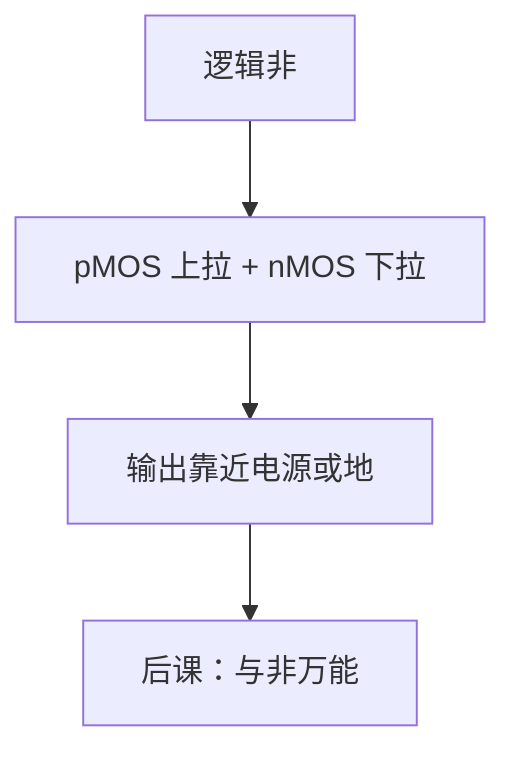

# CMOS 反相器

一个 pMOS 上拉、一个 nMOS 下拉，中间那根线才是稳定的 0 与 1；静态 CMOS 几乎不在稳态耗直流。

<footer>—— 据 Harris and Harris, Digital Design and Computer Architecture 整理</footer>

上一课[插值与龙格现象](/cs/interpolation-runge)把数值计算收到多项式拟合的边界。信息与离散更早已经结束。本课不重讲条件数，也不从半导体物理的能带另起。缺口是：程序与比特已经会写，布尔课的「非」还没有**器件**。数字逻辑与计算机组成从这里开始：先实现一个反相器。

## 问题

布尔 $\bar x$ 是函数。硅上要把电压映射回两个区间。缺口因此不是新的公理，而是一对互补晶体管：输入高则 nMOS 导通把输出拉到地，pMOS 截止；输入低则相反，输出拉到电源。互补使得稳态没有从电源到地的直流通路（忽略漏电）。

本课只钉这一格。与非、或非、万能门是[下一课](/cs/nand-universal)。阈值、传输特性画到「有噪声容限」为止，不把短沟道模型展开。

### 反相器不是「一个晶体管」

单 nMOS 加电阻上拉是 NMOS 逻辑，稳态有电流。CMOS 用 pMOS 代替电阻，极性相反。把反相当成开集电极或模拟放大器，会把后课的恢复性电平说错：数字要的是把中间电压推回轨。

Harris 第 1 章用 CMOS 反相器当数字抽象的物理锚。本课只承认有 p 管 n 管两种开关，不把工艺步骤当内容。

## 方法

符号：pMOS 源接 $V_{DD}$，nMOS 源接地，栅接在一起为输入，漏接在一起为输出。转移曲线中间有高增益区，两边饱和到轨。噪声容限定义为输入还能被当成合法 0/1 的余量。

## 机制

恢复性：被噪声推离轨的电压，经过一级（或奇数级）反相器可以拉回。这是第一课「判决」的电路实现。延迟来自对负载电容的充放电，下一课以后的门时延把这一格量化；本课只承认电容存在，不写 $t_{pd}=RC$。

功耗：动态是 $CV^2f$，静态理想为零。漏电使静态非零，本课承认但不建模。

## 边界

本课不讲工艺节点纳米数、FinFET。模拟偏置、差分对不属于主干。时序电路仍没有时钟。

后课默认：逻辑门的原子是 CMOS 复合物；稳态输出在轨附近；非由反相器实现。

## 小结

- CMOS 反相器：p 上拉 n 下拉，稳态几乎无直流。
- 高增益区提供噪声容限与电平恢复。
- 与非/或非网络、延迟公式是后课。
- 出处：Harris and Harris, *Digital Design and Computer Architecture*。
