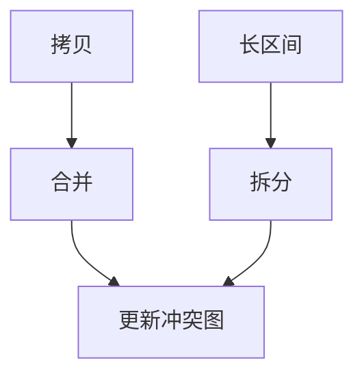

# 合并与拆分

合并把拷贝两端收成同一颜色，删 `mov`；拆分把长区间切开，降低度数、给调度和调用点喘息。二者都改冲突图，而不是改源程序。

<footer>—— 据 Chaitin 合并；George and Appel, Iterated Register Coalescing, 1996；Cooper 等 live range splitting 整理</footer>

上一课[Chaitin–Briggs](/cs/chaitin-briggs) 的图上来自 SSA 析构的大量拷贝。缺口是**合并**（coalescing）与**拆分**（splitting）。保守合并：不增加 $deg\ge K$ 的风险。激进合并再拆开。本课钉权衡，不写表调度。

## 问题

φ 析构与参数传递产生 `mov`。若两端无冲突，应收成同一虚名。过度合并拉长区间，度数升高，反而 spill。拆分：在循环外、调用点切开，插入新 `mov`，换更可着色的图。缺口是**何时并、何时拆**，不是简化栈。

George–Appel：在简化过程中迭代合并。

### 合并不是 GVN

GVN 删的是计算；合并删的是寄存器传送。值已相同，只是名不同。

George–Appel 1996。Hack 等 SSA 上合并。本课与线性扫描的区间拆分对照：同一思想，表示不同。

## 方法

保守：Briggs/George 准则。若拷贝在循环外、两端冲突则放弃或先拆。拆分点：循环边界、call、高压力块。

与重物化：常数拆分后可 remat 代替传送。

## 机制

SSA 上合并要保持常规形式。析构后再合并更简单。不要合并跨越不同寄存器类（int/float）。

调试：合并后两个源变量同一寄存器，调试器要靠位置列表——DWARF 后课。

## 边界

本课不写最优拆分 NP 证明。后课默认：拷贝用合并压，压力用拆分泄。下一课表调度：分配前后都可能调度，顺序与拆分交互。

也不把拆分当多线程 fork。

## 小结

- 合并消 `mov`；过并增度数。
- 拆分缩短区间，服务调用点与循环。
- 迭代合并（George–Appel）是标准工程。
- 出处：Chaitin；George and Appel, 1996；对照 Poletto 区间。
