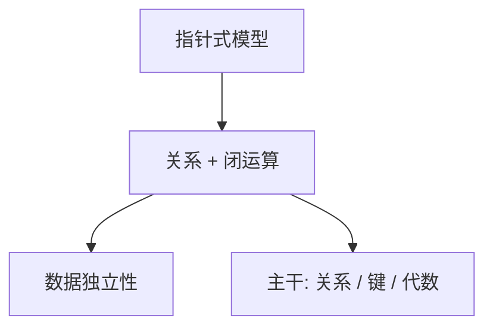

# Codd 关系模型

用关系与一阶谓词谈共享数据，使应用程序不必随存储布局改写；完整性与数据独立性是同一设计。

<footer>—— Codd, A Relational Model of Data for Large Shared Data Banks, CACM 1970</footer>

[上一课](/cs/saltzer-e2e-paper)附录对照了分组互联。附录对照，不插入主干。主干已在[关系模型](/cs/relational-model)、[键与完整性](/cs/keys-integrity)、[关系代数](/cs/relational-algebra)里用过元组、键与闭运算；这里对照 **1970 原文的问题**：大型共享库如何摆脱网状/层次指针，使查询成为关系上的运算。不重写 SQL 标准史。

## 问题

主干数据库第一课从套接字与文件的缺口进入：已有字节，尚未命名关系。Codd 1970 针对的是当时的数据独立性危机：存储一变，程序全改。原文给出关系、域、语言层次（代数与演算）以及完整性。1972 年完备性论文把代数与演算对齐，主干代数课已经点名。

System R 与 SEQUEL 是实现与语言落地，不是 1970 文的章节。Selinger 路径选择是 1979。附录不把优化器史插进 Codd 原文。

## 方法

数据是关系；子语言对关系封闭；存储与用户视图分离。键与参照是模式上的断言。主干从 Codd 取走的正是这一层，物理页与 WAL 来自 Gray 一线。读 1970 是为了看主干为何禁止「先讲 B+ 再讲表」。

## 机制

值连接代替指针，使引用可检查、可优化。后来的 SQL 包语义与 NULL 是工程缝，主干 SQL 课已承认。范式论文（1971/1972）把依赖写成设计工具，主干范式课已取用，本附录不展开分解算法。

### 为何对照而不插入主干

主干在网络课之后才进入数据库，因为课序是系统栈。把 1970 插在文件字节流之后当「下一课」会打乱「套接字留下的缺口」这一钩子。附录只对照原文问题，不改变课序。

## 边界

不要发明 Codd 的 arXiv。也不要把 NoSQL 论战写进 1970。下一篇对照 Diffie–Hellman 1976 如何让没有预共享密钥的双方建立共同秘密，那是公钥课的文献。

Codd 后来对 SQL 偏离集合语义有批评；主干已在 SQL 课承认包与 NULL，不在本附录重开标准战争。

对照结束应回到主干[关系模型](/cs/relational-model)。1970 文不改变「套接字之后才命名关系」的课序钩子。

## 小结
- 附录对照，不插入主干。
- 下一篇对照 Diffie–Hellman 1976。

- 附录对照 Codd 1970：关系、独立性、完整性作为共享库的抽象。
- 主干关系/键/代数课已取用；物理恢复来自后文。
- 不插入网络课与数据库课之间以外的位置——本篇根本不插入主干。
- 出处：Codd, *CACM* 13(6), 1970。
