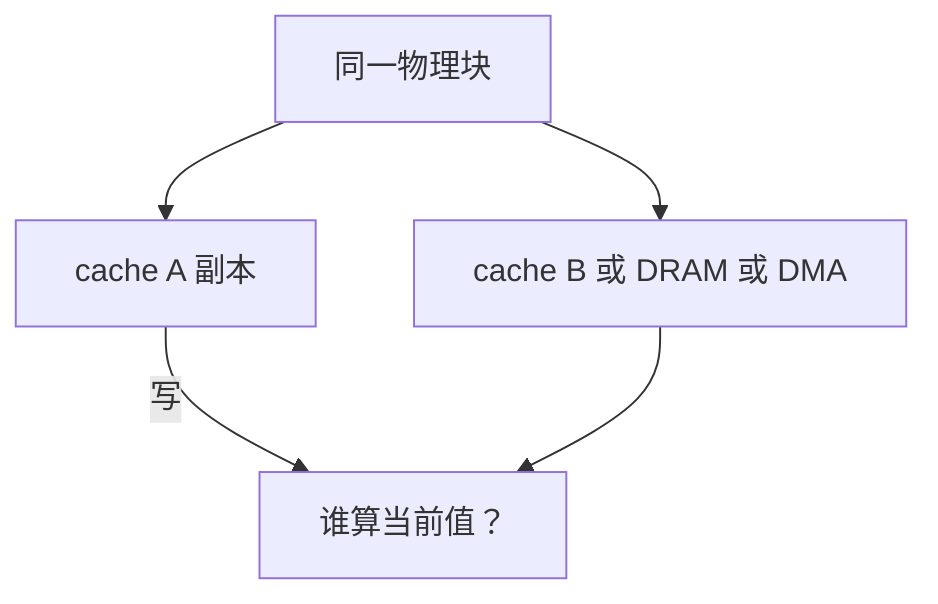

# 一致性问题引入

写回让同一块在 SRAM 与 DRAM 各有一份；再多一份 cache 或 DMA，谁手里的才算当前值，还没有协议。

<footer>—— 据 Hennessy and Patterson, Computer Architecture: A Quantitative Approach 整理</footer>

[上一课](/cs/asid-pcid)把页表收成树，TLB 仍缓存叶项。[写回与写分配](/cs/write-back-allocate)已经允许 cache 比下一层新。[SRAM 与 DRAM 阵列](/cs/memory-array-sram-dram)是两层物理介质。本课不重讲脏位怎么置。缺口是：一旦存在**同一物理块的多份副本**，读可能读到旧的。本课只把问题命名清楚，不引入 MESI 状态机；超标量与多核还在后面，但 DMA 与指令/数据 cache 已经够用来陈述问题。

## 问题

单核、单数据 cache、无 DMA 时，CPU 总从自己的 cache 读，写回的不一致对程序员不可见。加入指令 cache，self-modifying 会看见旧指令。加入 DMA，设备写 DRAM 而 CPU 还握着脏行或干净旧行。后课多核只是把「另一份 cache」变成常见情况。缺口不是再加相联度，而是**定义「这块的当前值在哪」以及「一份更新后别的份怎么办」**。

一致性关心同一地址的副本；多地址之间的可见顺序是[存储一致性模型](/cs/memory-consistency)，本课不提前。

Hennessy/Patterson 把 coherence 与 consistency 分开：前者单位置，后者程序序与多位置。

## 方法

先规定不变式：任意时刻，同一物理块的所有可读副本必须相同；若允许一份独占脏，则其他副本不得再当有效。写必须把别人的副本作废或更新。实现可以是总线窥探，可以是目录，本课都不选。

软件也可以靠显式冲刷（把脏行写回再让设备读），那是把一致性推给程序员。硬件协议的动机是：共享内存编程不想每条 store 后冲刷。

## 机制

问题一旦成立，[缺失分类](/cs/cache-miss-types)会多出一类：因为别人写而被作废，再读则缺失。这不是强制、容量、冲突能解释的。TLB 与页表同样有副本：内核改 PTE 后必须作废各核 TLB，否则翻译不一致。本课把 TLB shootdown 当作同一问题的翻译版，不写中断风暴。

精确异常与写回同时存在：提交过的 store 已经让某行变脏，一致性必须覆盖已提交状态，未提交的 store 仍可随冲刷消失。

## 边界

本课不给出 Invalid/Shared/Exclusive 状态，不画嗅探事务。那是[MESI](/cs/mesi-protocol)，且要等[多核与共享缓存](/cs/multicore-shared-cache)把「谁」说清。也不把问题写成「多线程锁」——锁需要一致性作为前提，但锁是操作系统课。

后课默认：谈到多份 cache，先承认有一致性问题。单核教学轨迹仍可暂时假装只有一份数据 cache。

## 小结

- 写回制造副本；第二份 cache 或 DMA 让旧值可见。
- 一致性：单地址上各副本如何跟上写。
- 协议状态机、多核互连是后课的缺口。
- 出处：Hennessy and Patterson, *CA:AQA* 多处理器 cache 一致性章。
