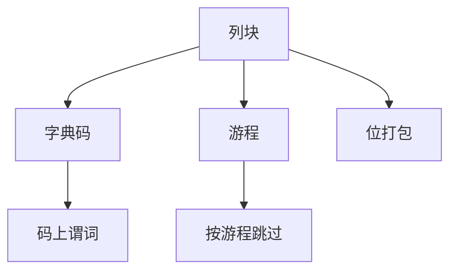

# 列压缩：字典、RLE、位打包

列上值域窄、重复多，编码比通用压缩更懂查询：比较可以在编码空间做，不必先还原成行。

<footer>—— 据 Abadi, Madden and Ferreira 列存压缩；Zukowski 等；C-Store</footer>

[上一课](/cs/columnar-pax)把列放在页或文件里。本课不重画 PAX。缺口是块内编码：分析列常低 NDV、排序后连续重复。字典、游程（RLE）、位打包（bit-packing）让扫描更少字节，且谓词有时能直接打在编码上（late decompression）。

## 问题

通用 gzip 把块变成需先解压再查的黑盒，谓词无法下推进压缩域。数据库编码要：**可跳过、可过滤、最好可比较**。字典：值→整数码，码上建比较或位图。RLE：有序列上 `(值, 长度)`。位打包：码宽按 max 码动态选 $b$ 位，不对齐浪费。缺口是按列统计选编码，不是「打开压缩开关」。

NULL 用位图，不进字典。增量编码、frame-of-reference 服务有序整数。本课钉三类主干。

Abadi, Madden, Ferreira，VLDB 2006 一类工作讨论压缩与查询。C-Store 把编码当一等设计。轻量编码通常胜过分块 gzip 在 CPU 上，除非网络传输瓶颈。

## 方法

ANALYZE 看 NDV、有序度、平均游程。选编码 → 写入列块头。扫描：向量化解码到列向量，或对字典码做谓词再回表值。连接：字典码若全局字典才可当键，局部字典要先解码或统一映射。

与 LSM：SST 内列块各有编码，compaction 重编码。与向量化：解码循环是 CPU 热点，编译执行可生成特化解码器。

## 机制

压缩改变代价模型：页数下降，CPU 上升。校准必须用压缩后扫描微基准，否则优化器以为磁盘是瓶颈。延迟物化：先对编码列过滤，再解码投影列。

更新：编码块不可原地改一行，常写新块——列存更新代价的一部分。

## 边界

本课不讲 Parquet 页头里的具体编码枚举——下一课格式标准。也不把 LZ4 当字典的替代定义。zone map 用 min/max 跳过，可在压缩块前。

后课默认：分析列块带编码；谓词尽量在码空间。Parquet/ORC：把编码、统计、row group 收成可交换文件。

编码是查询友好的压缩，不是备份压缩。

## 小结

- 字典、RLE、位打包服务扫描与过滤，常可延迟解码。
- 编码选择看 NDV 与有序度；代价模型要重校准。
- Parquet / ORC 下一课：开放列存文件合同。
- 出处：Abadi, Madden, Ferreira；C-Store；Zukowski 等。
