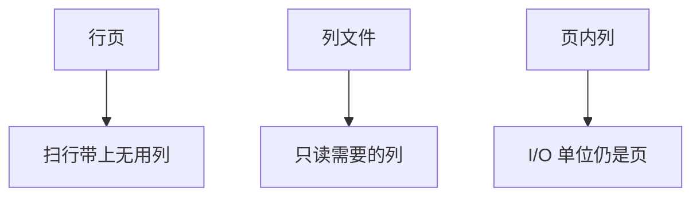

# 列存与 PAX

列存按属性切文件，扫描只读需要的列；PAX 在页内按列摆放，保持页为 I/O 单位，减少行组装的跨页随机。

<footer>—— 据 Copeland and Khoshafian DSM；Ailamaki et al. PAX, VLDB 2001；C-Store / MonetDB</footer>

[上一课](/cs/leveled-tiered-compaction)决定 LSM 文件如何分层。本课不调倍率。缺口是页/文件**内部布局**：行存一行连续，OLAP 扫描浪费带宽在无用列上。列存（DSM）每列一堆文件，延迟物化自然。PAX（partition attributes across）折中：一页里所有列的一段行，页间仍是行组。

## 问题

分析查询常 `SUM(a) WHERE b>`，只需两列。行页把整行带进缓存。纯列存：谓词列与度量列分别顺序扫，组装用位置对齐。跨列更新、点查、宽行插入在纯列上变随机或写放大。缺口是 **OLAP 布局 vs OLTP 行页**，不是新 SQL。

PAX：一个 row group 放进页，页内各列分别数组。缓存行上扫一列仍顺序，点查一行在同一页内可取齐列。C-Store、Parquet 的 row group 是同一思想的文件级版本。

Ailamaki, DeWitt, Hill, Skounakis，VLDB 2001 PAX。Copeland and Khoshafian 分解存储模型。Stonebraker et al. C-Store。本课布局；压缩下一课。

## 方法

行页：槽+记录。列文件：每列块+位置对齐或每列自有空值位图。PAX 页：页头、各列偏移、列数据。执行器向量化从 PAX 或列块直接填列向量，少经行中间态。

HTAP 后课用两份或可更新列存；本课只钉只读分析布局的动机。

## 机制

更新：行页原地或 MVCC 新行；列存常写新列块或 delta 再合并（LSM+列）。缓冲池：列块缓存与行页缓存权重不同，替换策略仍要抗扫描污染。

连接：列存上延迟物化用位置；shuffle 只发键列。与 exchange 课对齐。

## 边界

本课不讲字典/RLE。也不把宽列 Bigtable 当分析列存——宽列是稀疏行键模型，后课。PAX 不是「有了就不需要 Parquet」；文件格式课会把 row group 标准化。

后课默认：分析扫描用列或 PAX；点查可用行或覆盖索引。列压缩：编码使列块更小、跳过更狠。

布局服务访问模式。同一 SQL 在不同布局上计划常数不同，要重校准。

## 小结

- 列存减分析 I/O；PAX 在页内列化以免点查跨页。
- 更新与点查是列存的代价面。
- 列压缩下一课：字典、RLE、位打包。
- 出处：Copeland and Khoshafian；Ailamaki et al. PAX；C-Store。
