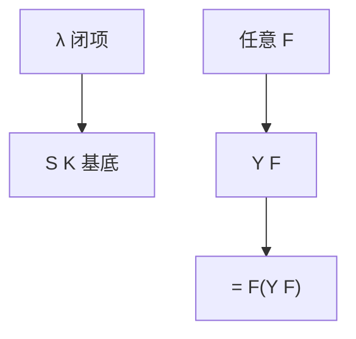

# 组合子与不动点

$S$ 与 $K$ 生成全部 λ 项的组合子片段；$Y=\lambda f.(\lambda x.f(xx))(\lambda x.f(xx))$ 给出不动点，递归不必「调用名字」。

<footer>—— 据 Curry；Schönfinkel；Barendregt 整理</footer>

上一课[λ 演算](/cs/lambda-calculus)用变量绑定写函数，并留下递归。缺口是两件：**组合子**（无自由变量的项，甚至无绑定器的 $SK$ 基底）与**不动点组合子** $Y$，把 Kleene 递归定理写成 β 等式 $YF = F(YF)$。

## 问题

绑定器让语法有环境。Schönfinkel–Curry：闭项可译成 $S,K$ 的应用，$I=SKK$。$Kxy=x$，$Sxyz=xz(yz)$。图灵完全性保留。不动点：对任意 $F$，要 $X$ 使 $X=FX$。$Y$ 满足 $YF\to F(YF)$。于是递归定义 $F=\lambda r.\cdots r\cdots$ 变成 $YF$。这与 TM 侧递归定理同一现象，对象是项不是编码。

$\Omega$ 是 $Y$ 作用在「忽略参数循环」上的亲戚；有不动点不等于有范式。

### $Y$ 不是最小不动点定理

Knaster–Tarski 在格上谈最小不动点，是后课验证。这里 $Y$ 只保证 β 等式，不管「最小」、不管语义域。Scott 域把二者接起来，本课不进。

Curry 的组合逻辑。Turing 也有不动点组合子 $\Theta$。Barendregt 第 6 章。实现里的 `letrec` 是编译器的回边，语义上相当于 $Y$。

## 方法

验证 $YF = F(YF)$ 的两步 β。用 $Y$ 写阶乘： $F=\lambda r.\lambda n.\mathrm{if}n0\,1\,(n\cdot r(n-1))$，$YF$ 为阶乘项。指出无类型才能把 $r$ 当函数又当值；$Y$ 在简单类型里不可类型化（后课）。

不要把 $S,K$ 当成优化过的指令集：它们极小，项会膨胀。用处是理论基底，不是虚拟机。

## 机制

可计算性单元到此：TM、λ、组合子同一类。自指有两种写法——编码上的 Kleene 与项上的 $Y$。下一单元加钟：时间层级。本课不开始数步。

组合逻辑等式理论不可判定（与 λ 相同）。Rice 的精神平移：非平凡的外延性质对项编码不可判定。

$Y$ 本身无范式，$YF$ 是否有范式取决于 $F$。Turing 的 $\Theta$ 满足 $\Theta F \to F(\Theta F)$ 且约化更「eager」。组合逻辑的等式理论不可判定，与 λ 相同。可计算性单元到此：三种语法、一个类。下一单元给同一台 TM 加上步数。

## 边界

本课不引入 $B,C,W$ 基底变体全文，不谈线性逻辑组合子。不把 $Y$ 写成 Python 装饰器教程。后课默认：递归 = 某不动点组合子；可计算模型在无类型 λ / TM 间可换。下一课时间层级定理。

可计算性课序在此封口：TM、λ、组合子同一类，自指有编码版与项版。下一单元开始数步数与格子，对象还是这些机器，只是多了资源。

## 小结

- $S,K$ 生成组合子逻辑，与闭 λ 项同等力。
- $YF=F(YF)$：递归是不动点，不是特殊语法。
- 有等式不等于有范式。
- 出处：Curry；Schönfinkel；Barendregt。
