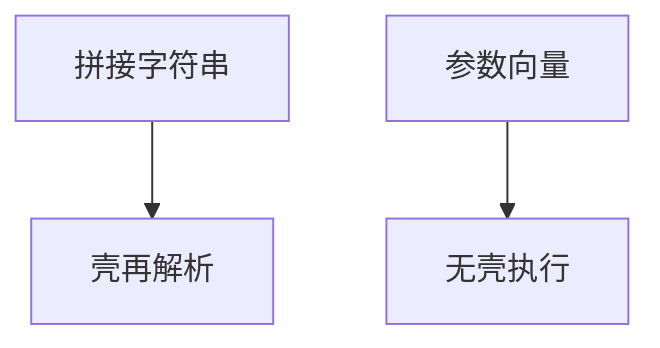

# 命令注入

把用户字符串拼进壳命令，等于把元字符交给壳。防御是不经过壳：参数数组、类型化 API，而不是黑名单转义。

<footer>—— 据 CWE-78；对照[注入](/cs/injection-boundary)</footer>

## 定位

上一课[路径](/cs/path-traversal-upload)是文件系统语法。缺口是**壳语法**。主干注入课已禁止拼接 SQL；本课落到 exec。不给命令 payload。

后课默认已经读完本课钉下的合同，只补差，不从该领域第一性原理重开。

## 问题

把路径拼进系统命令字符串。空白与元字符改变命令结构。缺口是 API：参数向量、无壳执行。

### 模板与邮件

不只是 shell：任何会调壳的库都算。

CWE-78。禁止注入教程。XXE 下一课是 XML 解释器。

## 方法

对照参数化查询。语言侧用列表形式的进程 API。下一课 XXE。

图中节点是本课的机制骨架；课程不把图展开成可运行的攻击步骤。

## 机制

控制通道与数据通道合一。最小特权也救不了本进程主动去执行外人命令。XXE 用 XML 特性读文件或出站。

前提写进合同之后，游戏外的误用只当失败模式点名，不在本课写成操作程序。

## 边界

零 payload。壳元字符是语法，不是「过滤分号」能穷尽的清单。XXE 下一课。

## 小结

- 路径是文件名语法；命令注入是壳语法。
- 永不经过壳；用参数数组。
- 转义黑名单不够。
- 下一课 XXE。
- 出处：CWE-78；[injection-boundary](/cs/injection-boundary)。

