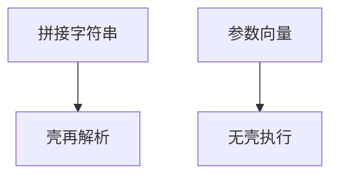

# 命令注入

把用户字符串拼进壳命令，等于把元字符交给壳。防御是不经过壳：参数数组、类型化 API，而不是黑名单转义。

<footer>—— 据 CWE-78；对照[注入](/cs/injection-boundary)</footer>

## 定位

上一课[路径](/cs/path-traversal-upload)是文件系统语法。缺口是**壳语法**。主干注入课已禁止拼接 SQL；本课落到 exec。不给命令 payload。

后课默认已经读完本课钉下的合同，只补差，不从该领域第一性原理重开。

## 问题

把路径拼进系统命令字符串。`system(s)` 等价 `/bin/sh -c s`：整串先过壳文法，`; | & $()`、反引号、`>` 都在数据位被重新解释，空格触发词切分，引号配对错让数据溢出到语法位。控制通道与数据通道共用一个串，是注入类缺陷的通式——[SQL 注入](/cs/injection-boundary)与路径穿越是它的两个实例。缺口是 API：参数向量、无壳执行。

### 模板与邮件

不只是 shell：任何会调壳的库都算。发信包装器拼 `sendmail` 命令行、构建脚本起子进程、包装器调 `find -exec`，都在应用与 exec 之间插了一层壳。参数即便进了 argv，被调程序自己再拼壳（仓库 hook、`ssh RemoteCommand`）仍会复发。

CWE-78。禁止注入教程。XXE 下一课是 XML 解释器。壳注入与参数注入是两族：后者是 argv 数据被下游当选项，`--` 分隔符只治后者。

## 方法

对照参数化查询：语句与参数分离。exec 侧是 `execve`/`posix_spawn` 的数组世界——路径、argv、envp 全是向量，壳没有入口。必须重定向或管道时在进程内做：`dup2`、`pipe` 代替 `>` 与 `|`；PATH 钉成绝对路径；envp 用最小集，防 `BASH_ENV` 一类经环境进壳。下一课 XXE。

```mermaid
flowchart TD
  STR["拼接字符串"] --> SH["壳再解析"]
  ARG["参数向量"] --> EXEC["无壳执行"]
```

图中节点是本课的机制骨架；课程不把图展开成可运行的攻击步骤。

## 机制

壳是图灵完备的解释器，拼接等于把用户输入当代码注入该解释器——与 XSS 同构。转义清单永不完备：元字符集合随实现变化，引号内的二次展开（反引号、`$( )`）仍可能发生。最小特权限制爆炸半径，不改注入成立：进程主动执行了外人命令。Shellshock（CVE-2014-6271）点名壳自身也是攻击面：环境变量经 bash 函数导出成可执行体。残余失败模式是参数注入：以 `-` 开头的路径被下游程序当选项，靠 `--` 分隔或白名单校验。XXE 用 XML 特性读文件或出站。

前提写进合同之后，游戏外的误用只当失败模式点名，不在本课写成操作程序。

## 边界

零 payload。壳元字符是语法，不是「过滤分号」能穷尽的清单；黑名单转义是在错误的层修文法问题。XXE 下一课。

## 小结

- 路径是文件名语法；命令注入是壳语法。
- 永不经过壳；用参数数组。
- 转义黑名单不够。
- 下一课 XXE。
- 出处：CWE-78；[injection-boundary](/cs/injection-boundary)。
