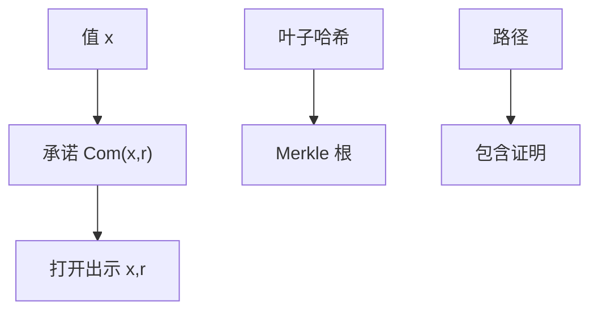

# 承诺与 Merkle 树

承诺先把值藏进盒子：隐藏、绑定，稍后打开。Merkle 树把许多叶子收成一个根，证明某叶子在集合里只需一条路径，不必公开整棵树。

<footer>—— 据 Pedersen 承诺；Merkle, Protocols for Public Key Cryptosystems, 1980；对照 RFC 6962 对 Merkle 的使用</footer>

## 定位

上一课[零知识](/cs/zero-knowledge-intuition)常把承诺当内部消息。缺口是把**承诺**与**集合摘要**钉成工程对象。主干哈希已有；本课不重证碰撞，只讲绑定来自碰撞难、隐藏来自预像或盲随机。

后课默认已经读完本课钉下的合同，只补差，不从该领域第一性原理重开。

## 问题

ZK 的第一轮常是承诺。简单 $H(x\|r)$：碰撞难则绑定，r 足够则隐藏。Pedersen 在离散对数假设下可加同态，本课点名。Merkle：叶哈希向上，包含证明是 $\log n$ 个兄弟。缺口是这两件零件，不是 CT 日志的政策（更后）。

### 根换了就要重证

叶子一改根变。时间戳只钉某刻的根，不自动更新。

Merkle 1980。证书透明、Git、比特币都用变体；本课不进量化账本。隐藏在哈希承诺里对短 x 要加盐，否则可穷举。

## 方法

写承诺的两条游戏。画一层 Merkle 路径。指出证明泄漏路径上的兄弟哈希，集合结构部分可见——需要时用更强的零知识集合。

图中节点是本课的机制骨架；课程不把图展开成可运行的攻击步骤。

## 机制

绑定服务完整性：不能换叶子还声称同一根。隐藏服务保密：未打开前 x 不泄漏（在假设下）。二者与 AEAD 不同：承诺通常不传输「可解密的密文」，只传输可稍后打开的绑定。

前提写进合同之后，游戏外的误用只当失败模式点名，不在本课写成操作程序。

## 边界

本课不把稀疏 Merkle 与 Verkle 写全。秘密共享下一课：把一个秘密拆给多人，与「承诺一个值」正交。

## 小结

- ZK 对话常吃承诺；本课钉隐藏与绑定。
- Merkle 用哈希树做集合包含证明。
- 短消息承诺必须加盐，否则穷举破隐藏。
- 下一课 Shamir 秘密共享。
- 出处：Merkle, 1980；Pedersen；对照 Katz and Lindell 的承诺定义。
