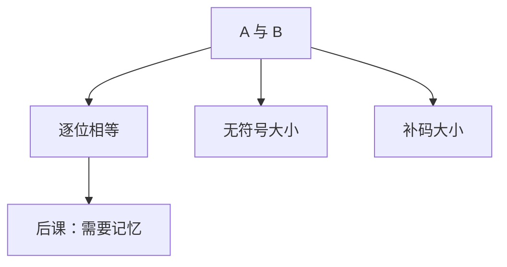

# 比较器

相等是逐位同或再与；大小则要声明按无符号还是补码读，不能共用同一条「最高位」故事。

<footer>—— 据 Harris and Harris, Digital Design and Computer Architecture；Patterson and Hennessy, Computer Organization and Design (RISC-V) 整理</footer>

上一课[ALU 数据通路](/cs/alu-datapath)把 `slt` 并进减法结果。本课不重画 ALU 内部 MUX，也不从排序算法另起。缺口是：比较作为**独立组合功能**要说清三种输出——相等、无符号小于、有符号小于——以及它们与[补码](/cs/twos-complement)两种读法的关系。后课分支 `beq`/`blt`/`bltu` 依赖这些位。

## 问题

ALU 减法能做 `slt`，但相等更便宜：不必走 CLA。缺口因此不是新的整数定义，而是比较器电路：$\mathrm{eq}=\bigwedge_i (a_i\leftrightarrow b_i)$；无符号大小从最高位向低扫描第一位差异，或用减法的进位/借位。有符号大小不能只看最高位：负数最高位为 1，但 $-1> -2$。正确做法是按补码语义用减法溢出与符号，或先比较符号再比较幅度。

RISC-V 把三种比较拆进不同指令，同一比特、不同旗标。本课只钉组合如何出这三位。

### 最高位不是无符号的「符号」

无符号比较把最高位当最大权，[进制课](/cs/positional-notation)的 $2^{n-1}$。有符号才把该位当负权。把「看 MSB」当成万能比较，`bltu` 与 `blt` 会接反。

Harris 有专用比较器级联。Patterson/Hennessy 强调 `slt` 与 `sltu`。分支用减法零旗标或比较器，单周期里常复用 ALU。

## 方法

相等：异或树再或非。无符号：从 MSB 起的优先编码「谁先出现 1」。有符号：若符号不同则负者小；符号同则化为无符号比较幅度（或减一次看旗标）。延迟：相等可浅；全大小比较与加法器同阶，CLA 减法仍可用。

## 机制

后课 `beq` 看 eq 或 ALU 零。`blt` 看有符号小于，`bltu` 看无符号。立即数比较 `slti` 同一通路。比较器也可以不进 ALU、单独放在分支路径上，以缩短某些设计的关键路径——那是单周期课的布局选择。

## 边界

本课不比较浮点（754 的 NaN 无序，规则不同）。不把字符串字典序提前。三态、模拟电压比较器不是数字块。

组合到此仍无记忆：比较完结果若不存下来，下一瞬输入变就丢。下一课锁存与触发器才开始时序。

后课默认：整数比较分 eq / 有符号 / 无符号三套；硬件可复用减法或独立比较器。

## 小结

- 相等是按位同；大小必须先声明编码。
- `blt` 与 `bltu` 不是同一旗标。
- 比较仍是组合；状态要从下一课开始。
- 出处：Harris and Harris；Patterson and Hennessy, COD (RISC-V)。
