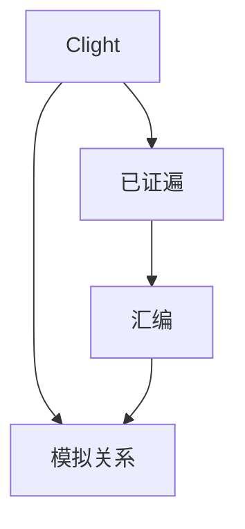

# CompCert 与编译器正确性

对 Clight 到汇编的每一遍给出证明：若源有定义行为，目标的观察与源相关。信任基是证明助手核与公理，而不是优化直觉。

<footer>—— 据 Leroy, Formal Verification of a Realistic Compiler, 2009；对照[证明助手](/cs/proof-assistants) 与[操作语义](/cs/operational-semantics) 整理</footer>

上一课[DSL](/cs/dsl-embedding) 仍可能错降。缺口是**经证明的编译**：CompCert。本课钉模拟关系与「不证明 UB 源」，模糊测试下一课是另一条质量路。不重写 CIC。

## 问题

优化编译器大，测试覆盖不到全部变换。[健全性](/cs/type-soundness) 是语言的；这里是**编译器**的：$\mathrm{beh}(S) \supseteq \mathrm{beh}(C(S))$ 一类（具体陈述看论文：未定义可更任意）。缺口是**逐遍证明**，不是 lex。

CompCert 不覆盖全部 GCC 优化，换保证。

### 正确性不是「生成代码很快」

性能另测。证明保证语义，不保证最优寄存器分配。

Leroy 2009 CACM/POPL 系列。Coq。本课不列全部中间语言名。与 UB 课：源 UB 则定理不约束。

## 方法

每遍：小步或大步语义 + 向前/向后模拟。组合。抽取 OCaml 编译器。信任：Coq 核、反汇编器、ABI 公理。

与[SSA](/cs/ssa-form)：CompCert 有自己的 SSA 与证明负担。工业 LLVM 用测试+fuzz，少全证。

## 机制

未模型化的 IO、内联汇编、并发（早期）在保证外。不要把 CompCert 当 C++ 全语言。链接：分离编译有后续工作，点名。

抽取代码仍要 OCaml 运行时——信任基。

## 边界

本课不写 Csmith。后课默认：现实编译器可形式化子集。下一课编译器模糊测试 Csmith。

也不把 CompCert 当电子设计自动化。

## 小结

- CompCert：逐遍模拟，定义行为被保留。
- UB 源不在定理内；优化范围小于 GCC。
- 信任基是助手核与公理。
- 出处：Leroy, 2009；对照 Wright–Felleisen、Coq。
