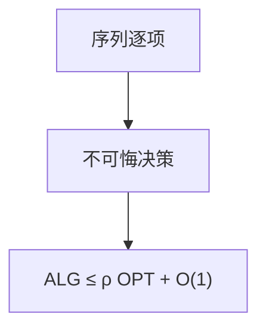

# 在线算法与竞争比

输入一个个到来、决策不可悔；竞争比是算法代价与事后最优的最坏比，对手可自适应。

<footer>—— 据 Sleator and Tarjan, Amortized Efficiency of List Update and Paging Rules, 1985；Borodin and El-Yaniv, Online Computation and Competitive Analysis 整理</footer>

上一课[随机游走](/cs/random-walk-mixing)假定图已知。在线：未来未知。主干摊还已会势能。缺口是竞争比 $\mathrm{ALG}/\mathrm{OPT}\le\rho$。不重写 Karger。后课分页、租买、秘书都是实例。不把限价簿当输入模型。

## 问题

离线 OPT 看见全序列。在线第 $t$ 步只看见前 $t$。确定性在线常被对手压到下界。随机在线对 oblivious 对手可更好。势函数证竞争比：摊还代价 $\le\rho\cdot$ 一步 OPT。

缺口是定义，不是具体分页（下一课）。

### 不是平均情形

竞争比最坏序列。平均输入是另一模型。不要把「实践还行」当 $\rho$。

Sleator–Tarjan 1985 列表更新与分页。Borodin–El-Yaniv 书。后课分页、ski-rental、秘书。

## 方法

先写离线最优结构。设计在线，势或不变量证 $\rho$。给下界：对手策略。随机算法写清对手模型。

加性常数允许。

## 机制

势把未来债务记在数据结构状态上。对手论证后课专讲。与近似比：近似是离线多项式对 OPT；在线是信息缺失。与流算法：流可事后输出，在线必须即时行动。

## 边界

本课不写全部 k-server。不写预测增强在线。后课默认：在线质量用竞争比。下一课页面置换。

## 小结

- 竞争比 = 最坏 ALG/OPT。
- 势函数是主证法。
- 与离线近似、流模型不同。
- 出处：Sleator and Tarjan, 1985。
