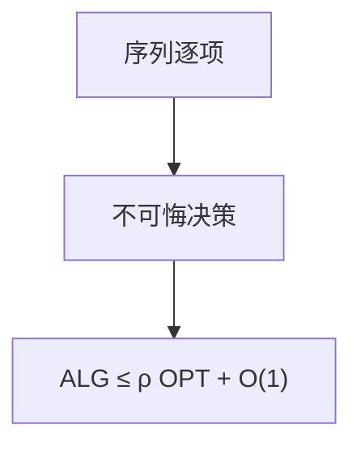
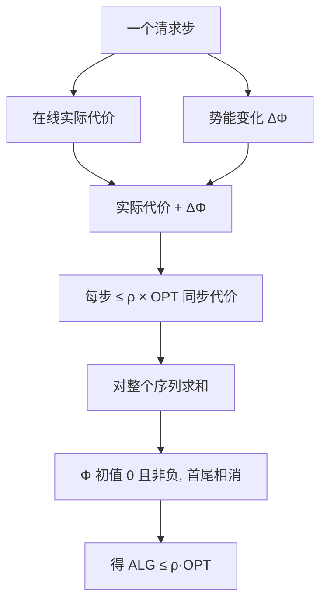

# 在线算法与竞争比

输入一个个到来、决策不可悔；竞争比是算法代价与事后最优的最坏比，对手可自适应。

<footer>—— 据 Sleator and Tarjan, Amortized Efficiency of List Update and Paging Rules, 1985；Borodin and El-Yaniv, Online Computation and Competitive Analysis 整理</footer>

上一课[随机游走](/cs/random-walk-mixing)假定图已知；在线算法连输入都是逐步揭示的，决策不可悔。势能法你已会，缺口是竞争比的定义：$\mathrm{ALG}\le\rho\cdot\mathrm{OPT}+O(1)$，取每个序列上的最坏比值。不重写 Karger。后课分页、租买、秘书都是本课定义的实例；不把限价簿当输入模型——那是 quant 栏的对象。

## 问题

同一问题给两方做：离线 OPT 看见完整序列后从容规划；在线第 $t$ 步只看见前 $t$ 个请求，却必须当场付出代价。差距可以很大：确定性算法下，对手总能构造专打弱点的序列压到下界；换成随机算法、对手 oblivious（出题前不知硬币结果），界可以更好。证明上界的主力是势函数：取 $\Phi\ge 0$、初值 $0$，使每步满足「实际代价 $+\Delta\Phi\le\rho\times$ OPT 同步一步的代价」，求和后势能项首尾消去，只剩 $\mathrm{ALG}\le\rho\cdot\mathrm{OPT}$。

缺口是定义，不是具体分页（下一课）。

直觉类比：在线算法像只能看当前这一手的棋手；离线 OPT 像开了天眼、看完整盘对局才从容落子。竞争比回答的是：不开天眼的选手，最坏情况下要比开了天眼的选手多付出几倍代价。

### 不是平均情形

竞争比取遍所有序列的最坏值；平均输入是另一套模型，结论互不推出。不要把「实践还行」当 $\rho$——竞争比是保证，不是口碑。

Sleator–Tarjan 1985 列表更新与分页。Borodin–El-Yaniv 书。后课分页、ski-rental、秘书。

## 方法

次序：先写离线最优解的结构（它定义分母），再设计在线策略、用势或不变量证上界，最后给下界——构造对手策略，证明任何在线算法都逃不过某个 $\rho_0$。上下界夹住，才谈得上这个竞争比是正确价格。随机算法必须写清对手模型。

术语翻译：oblivious（非自适应）对手，就是「出题前不知道你掷硬币结果」的出题人——题目与你的运气相互独立；自适应对手则边看你的每步动作边改题，能压得更狠。所以谈随机算法的竞争比，必须先声明对手是哪一种。

```mermaid
flowchart TD
  IN["序列逐项"] --> ON["不可悔决策"]
  ON --> RHO["ALG ≤ ρ OPT + O(1)"]
```

右边允许加性常数 $O(1)$：OPT 极小的序列上比值无界，加常数让定义良态。

## 机制

势函数的直觉是把「未来要还的债」记在数据结构状态上：状态越懒散（如缓存里留着迟早要换出的页），$\Phi$ 越高，当前多付的摊还代价就是提前还债；初值 $0$、终值非负，求和时 $\Phi$ 首尾相消，剩下的恰是摊还不等式。对手论证后课专讲。与近似比区分：近似算法拿到完整输入、受限于多项式时间，输给的是算力；在线算法想算多久都行，输给的是信息缺失。与流算法区分：流模型只限内存、允许读完全部输入后再输出，在线必须在请求到达的当下承诺行动。

```mermaid
flowchart TD
  STEP["一个请求步"] --> PAY["在线实际代价"]
  STEP --> DPHI["势能变化 ΔΦ"]
  PAY --> AM["实际代价 + ΔΦ"]
  DPHI --> AM
  AM --> INEQ["每步 ≤ ρ × OPT 同步代价"]
  INEQ --> SUM["对整个序列求和"]
  SUM --> CANCEL["Φ 初值 0 且非负, 首尾相消"]
  CANCEL --> CONC["得 ALG ≤ ρ·OPT"]
```

常见误区：把 $\rho=2$ 理解成「每次都吃亏一倍」。它的准确含义是：无论对手出什么序列，你的总代价不会超过最优的两倍加常数——有些序列上恰好差满两倍，多数输入可能远好于此。竞争比是最坏情况保证，不是平均预期。

## 边界

本课不写全部 k-server 理论，也不写预测增强在线——那里 $\rho$ 变成预测误差的函数。后课默认：谈在线算法质量就用竞争比。下一课页面置换。

## 小结

- 竞争比 = 最坏 ALG/OPT。
- 势函数是主证法。
- 与离线近似、流模型不同。
- 出处：Sleator and Tarjan, 1985。
