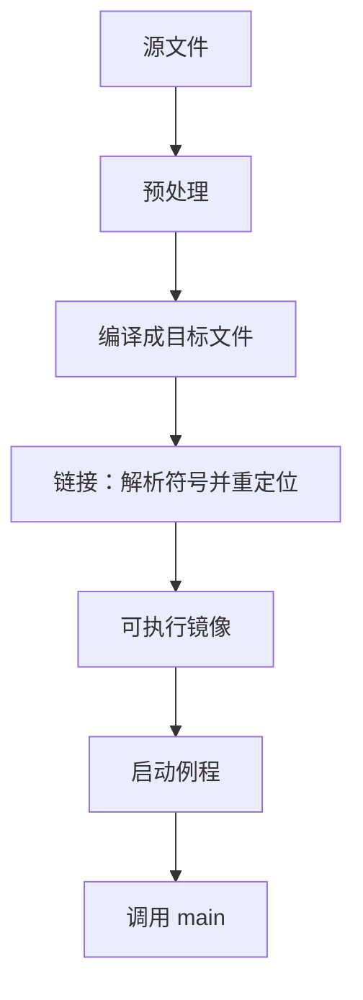

# 编译、链接与入口

源文件是文本；可执行文件是机器能加载的字节布局。中间隔着翻译、合并符号，以及一条约定好的入口。

<footer>—— 据 Kernighan & Ritchie, The C Programming Language, 2nd ed.；ISO/IEC 9899；Bryant and O'Hallaron, Computer Systems: A Programmer's Perspective 第 7 章整理</footer>

本课是计算机栏第一课。后面的存储区、指针、调用约定、比特与门电路，都默认你会把「写下的语句」和「进程里从某个地址取指」连起来，不再从「计算机是什么」或香农比特另起。后课默认已经读完本课。缺口只有一条：一行 `printf` 怎样变成 CPU 从固定入口开始执行。

## 问题

人写的是函数名与类型；加载器要的是按段排好的字节，以及第一条指令的地址。单文件可以假装「编译即镜像」；多文件、库与启动代码必须**链接**——把各编译单元的重定位片段拼成一张地址地图，解析外部符号，填上真正的跳转与数据地址。缺口因此不是 C 语法，而是工具链分工：谁产出可重定位目标，谁把符号绑死，进程为何不从 `main` 的第一个字节起步。

把整条链当成黑盒，链接时报 `undefined reference` 时不知道该改哪个 `.o`；调试时行号与指令对不上，也是同一缺口。本课只铺流水线；宏展开留给[预处理器](/cs/preprocessor-preview)，参数怎么进寄存器留给[调用约定直觉](/cs/calling-convention-preview)。

### `main` 不是第一条指令

`main` 是程序员看见的语义入口。进程真实的第一条用户指令在启动例程（C 运行时，常称 crt）：它整理参数与环境，再调用 `main`，再把返回值交给 `exit`。把「入口」等同于 `int main`，后课谈动态链接与进程布局时会对不齐。

K&R 用 `cc` 驱动预处理、编译、链接。ISO C 把 translation unit 与链接阶段分开：同一标识符如何跨单元合并，是[模块与头文件](/cs/module-header)的缺口。CSAPP 第 7 章把目标文件、符号解析与重定位写成程序员可见的机器模型。

## 方法

典型 C 路径：源文件经过预处理得到编译单元；编译器产出目标文件，内含代码段、数据、重定位表与符号表；链接器合并这些片段，解析 `extern`，写出可执行镜像或共享库。静态链接把用到的库代码拷进镜像；动态链接把解析推迟到加载或首次调用，见[动态链接直觉](/cs/dynamic-link-preview)。

符号分定义与引用。两个强符号同名则链接失败；未定义符号——声明了却没有任何单元给出定义——同样失败。弱符号与公共符号是实现细节，本课只记：**编译各自产出碎片，链接器负责拼成一张可加载的地址地图**。

## 机制

目标文件里的跳转与取址在链接前是占位。链接器按最终布局计算各段基址，把占位改成相对或绝对地址——这就是重定位。没有这一步，多文件程序无法互相调用。加载器把镜像映射进进程之后，控制权交给入口符号；用户代码从 `main` 才开始有定义。

理解这条链，下一课才能问：镜像里的全局变量、函数里的自动变量、运行时申请的块，分别落在哪片地址上。那些区域不是语法糖，而是链接与加载留下的分区。

分别编译能成立，是因为每个目标文件把自己还不知道的地址留成重定位项，而不是把「整个程序」一次吃进编译器。调试信息、栈展开表也可以作为段被链接器搬运，但本课不依赖它们：只要符号解析与入口约定在，后课的栈帧、库与系统调用才有附着点。把入口想成 `main` 的花括号，会在 crt 初始化全局构造、环境指针、对齐栈之前就去谈程序语义，顺序反了。

## 边界

本课不讲指令编码，也不讲虚存如何把文件映成页。ISA 与页表是组成、操作系统后课。也不把预处理器的 `#include` 守卫在此展开。大模型栏的「编译」是另一套图编译，本栏不写 Transformer。

后课默认：多文件程序经编译得到带重定位的目标文件，经链接得到镜像，经加载从约定入口进入用户代码。下一课[栈、堆与静态存储](/cs/stack-heap-static)在这张镜像上划分寿命。

## 小结

- 编译按编译单元产出带重定位的目标文件；链接合并片段并解析符号。
- 可执行镜像含代码、数据与入口；`main` 由启动代码调用，不是进程第一条指令。
- 静态链接在链接期并入库代码；动态链接推迟解析。
- 后课默认已会把源语句对应到入口之后的地址。
- 出处：K&R；ISO/IEC 9899 翻译与环境；CSAPP 第 7 章。
