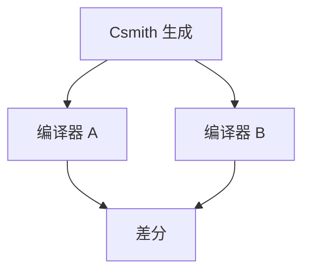

# 编译器模糊测试 Csmith

随机生成仍属于定义行为的 C 程序，在多个编译器或优化级别间比较输出。差异则是 bug。这是测试，不是 CompCert 的证明。

<footer>—— 据 Yang, Chen, Eide and Regehr, Finding and Understanding Bugs in C Compilers, 2011；对照 CompCert 整理</footer>

上一课[CompCert](/cs/compcert-correctness) 给出证明路线。缺口是对 **GCC/LLVM** 的找虫：Csmith 生成避免 UB 的程序，差分测试。自举下一课收束课程。不发明 arXiv；Yang et al. PLDI 2011 是锚。

## 问题

手写用例覆盖不到优化组合。随机程序太大，若含 UB，差分无意义（优化可合法不同）。Csmith：静态避免许多 UB（不越界、不未初始化用、谨慎有符号溢出）。缺口是**生成器纪律 + 差分**，不是 Coq 战术。

发现：未定义假设过强、错误的别名、错误的卷绕。

### fuzz 不是证明

未找到 bug ≠ 正确。与 CompCert 互补：一个保子集，一个打工业编译器。

Yang et al. 2011 PLDI。Regehr 组后续 C-Reduce。本课不把 AFL 当 C 语义生成器；AFL 不保证无 UB。

## 方法

生成 → 多编译器运行 → 比 stdout/返回值。失败：缩减（C-Reduce）得小用例。也可对解释器/CompCert 当参考。

与[内存模型](/cs/language-memory-model)：并发生成更难，Csmith 以单线程为主。

## 机制

超时、栈溢出要当测试工具问题。优化级别 `-O0` vs `-O2` 也是差分对。不要用含 UB 的还原用例去「证明编译器坏」。

覆盖：随机仍有盲区（某条稀有 IR 形状）。

## 边界

本课不写自举。后课默认：工业编译器用生成+差分找虫。下一课自举：编译器用自己编译自己。

也不把 fuzz 当网络协议 fuzz 教程。

## 小结

- Csmith：无 UB 随机 C + 差分测试找编译器 bug。
- 与形式化验证互补，不是替代。
- 缩减得到可报告用例。
- 出处：Yang, Chen, Eide and Regehr, 2011。
