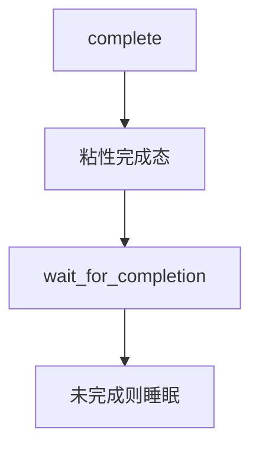

# completion

完成量表示「这件事已经发生过」：等待者睡到一次性事件，唤醒后事件仍然为真，不必再在循环里猜谓词。

<footer>—— 据 Love, Linux Kernel Development；Hoare 管程里一次性会合的对照整理</footer>

[上一课](/cs/monitor-condvar)用条件变量等任意谓词，Mesa 语义下必须循环检查。[信号量](/cs/semaphore) 的 V 可以累计。缺口是内核里极常见的会合：**completion**——生产者做完初始化或 I/O，消费者 `wait_for_completion`，事件是一次性（或可再 init）的粘性真。本课钉这个窄对象，不把 RCU 请进来。

## 问题

`wait(&c)` 在管程里等的是「缓冲非空」这类会再变假的谓词。模块加载结束、设备探测结束、一次 DMA 做完，则「完成」一旦为真就保持，直到有人显式再清。用 condvar 也能写，但容易漏 `signal`、容易虚假唤醒后条件仍假。completion：内部计数或标志 + 等待队列，`complete` 后后来的 wait 立即通过。缺口不是再讲 Mesa 循环，而是这种**粘性事件**。

`complete_all` 唤醒当前所有等待者并把完成态留下；之后再 wait 的人也直接过。再武装需要 `reinit_completion`。

## 方法

声明 `struct completion`。消费者 `wait_for_completion`：若已完成则返回，否则睡。生产者 `complete`：置完成，唤醒。可中断版本对接[重启系统调用](/cs/restart-syscall) 与信号。超时版本失败则调用方处理；事件仍可能稍后到来，须规定是否还 complete。

与 IRQ：[中断下半部](/cs/interrupt-bottom-half) 里可以 `complete`，等待者必须是线程上下文。

## 机制

completion 把「一次性会合」从通用管程里拆出来，减少谓词错误。它不是锁：完成不保护数据结构的互斥，只同步「可以开始用」。若完成前数据要可见，生产者在 `complete` 前要有 release 语义，消费者 wait 返回后 acquire——[内存屏障](/cs/memory-barrier-os) 已给出。

多次 `complete` 对只 wait 一次的人通常只多算一次；语义以所用内核文档为准，主干只要求一次性事件不要靠「多 V 几次」来凑。

## 边界

本课不把所有 `wait_for_completion_*` 变体当手册。屏障、RCU 同步不是 completion：RCU 等的是「所有读者离开」，下一课。也不把 pthread_barrier 的 N 人会合写成同一对象。

后课默认：一次性事件用 completion。读多写少、读者不能睡也不能重试撕数据时，下一课 RCU 读者。

## 小结

- completion：粘性「已发生」；wait 在线程，complete 可在下半部。
- 不替代互斥，只做会合。
- 无锁只读遍历是 RCU 课。
- 出处：Love, *LKD*。
