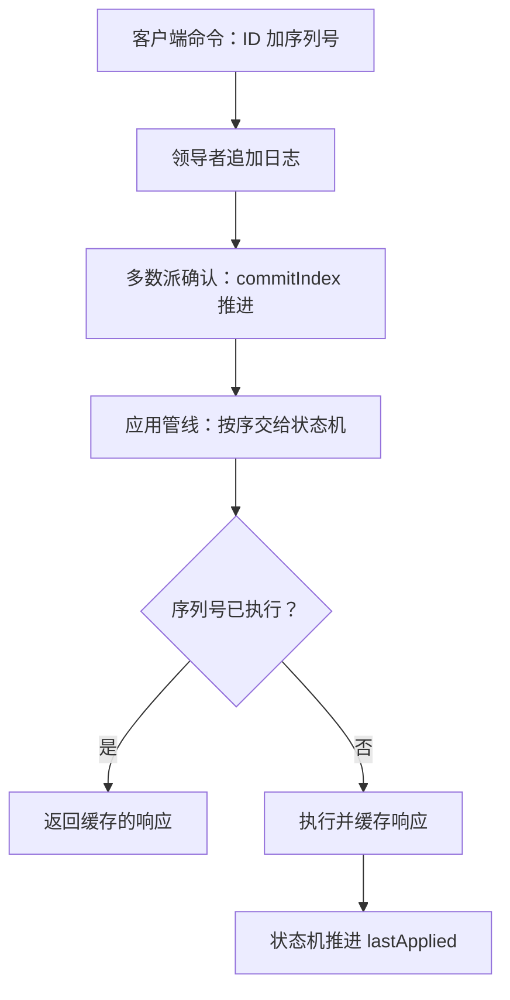

# 共识与复制状态机

共识只决定日志的顺序；把日志变成服务的一切——确定性执行、不确定性入日志、对客户端恰好一次——都是状态机侧的合同，也是共识优化到头之后剩下的硬界。

<footer>—— 据 Schneider, ACM Computing Surveys, 1990 与 Ongaro 博士论文, 2014 整理</footer>

[上一课](/cs/con-linearity-testing)给了检验历史的工具，但用户看到的不是日志而是状态机的输出。主干课的[复制状态机](/cs/replicated-state-machine)立过「同一确定性 $\delta$、同一已提交日志」的骨架；本课拆共识引擎与状态机之间的接缝：提交与应用的错位、非确定性怎么进日志、客户端重试怎么收到恰好一次。

## 问题

两个 index 永远错位：共识推进到 commitIndex $c$，状态机应用到 lastApplied $a$，而 $a \lt c$ 是常态——复制是网络上的多数派确认，应用要执行业务逻辑。错位裂出三条缝。第一是读：领导者知道 $c$，状态机只走到 $a$，刚提交的写还没生效，读状态机会拿到旧值，读自己写破裂。第二是副作用：apply 异步，崩溃重启后从快照加重放恢复，重放会把「发邮件、扣款」再执行一遍——共识保证日志不重不丢，不保证副作用不重。第三是客户端：RPC 超时后重试同一命令，若不去重，日志里两条条目、状态机执行两次。

## 方法

接缝三件事。其一，应用管线：已提交条目按序交给状态机，apply 异步推进，进度本身要持久化或从快照恢复——重启后从快照记录的 applied index 继续，重放只补未应用段。其二，非确定性全走日志：时间戳、随机数、自增号、外部调用的返回值，要么由领导者提议进日志再统一采用，要么把「含结果的完整记录」作为日志条目；$\delta$ 保持纯函数，同一日志在任何副本推出同一状态。其三，会话去重：每客户端唯一 ID 加单调序列号，状态机维护「每会话最近已执行序列号与响应缓存」，重试命中即返回缓存响应——恰好一次从这里来。去重表是状态机状态的一部分，必须进快照，否则重启后的重放又执行一遍。

Raft 论文建议的会话去重最容易被漏掉一半：响应缓存要有界——领导者换了、会话过期了就作废缓存并让客户端重建会话；无界缓存本身就是新的故障面。

## 机制

读路径的账在 $a$ 与 $r$ 之间：ReadIndex 给出读序号 $r \le c$，实现要等状态机追到 $a \ge r$ 才应答——排队而非猜测；租约读同样受 $a$ 约束，租约过期就必须退回心跳确认。这就是优化到头剩下的硬界：写延迟的下限是一轮多数派确认，读的新鲜度下限由 apply 进度决定，共识侧的聪明绕不过其中任何一条。快照是接缝的另一件工具：状态机在某时刻的全量镜像压缩日志、缩短重放，安装快照就是强制对齐 $a$；历史检验里常见的读旧值违例，来源常在快照安装与 apply 进度的交接处。对外部世界的写没有撤销语义，副作用应当改写成「日志携带动作、状态机代发」，并配[幂等键](/cs/idempotency-keys)与 [fencing](/cs/distributed-lock-fencing)——日志回滚也收不回已经发出的邮件。

## 边界

确定性之外共识救不了：状态机自身的 bug、运行时的非确定 GC、跨状态机的顺序依赖，都会让「同一日志」推出不同状态；跨组事务与隔离级别另有专课，跨组原子性的起点是[共识与 2PC](/cs/consensus-vs-2pc)。本课也不重写 RSM 定义与读档位（第一课已给三档读），只钉接缝：错位、去重、快照交接。

## 小结

- $a \lt c$ 是常态：读的新鲜度由 apply 进度决定，不由 commitIndex 决定。
- 非确定性必须进日志，$\delta$ 纯函数化；否则同一日志在副本间推出不同状态。
- 恰好一次靠会话 ID、序列号与有界响应缓存；去重表要进快照。
- 副作用改写成「日志携带动作、状态机代发」，配幂等键与 fencing。
- 出处：Schneider, ACM Computing Surveys 1990；Ongaro 博士论文 2014（客户端会话一节）。
