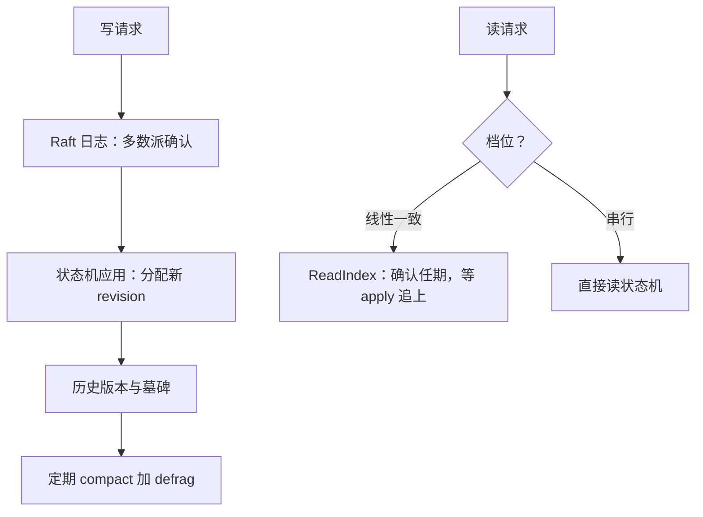

# etcd 案例走读

etcd 的价值不在它跑的是 Raft，而在它把 Raft 装配成一个能被整个 Kubernetes 依赖的产品：修订号、租约、watch、配额——每一样都是共识之上的最小合同。

<footer>—— 据 etcd 官方文档整理；定位与对照另见 Burrows, The Chubby lock service, OSDI 2006</footer>

[上一课](/cs/con-consensus-rsm)拆了共识引擎与状态机的接缝；本课把这份合同读进一个真实产品。主干课的 [etcd / Chubby](/cs/etcd-chubby) 已给过定位：共识做成锁与配置 API；本课下到 etcd 的具体机制——MVCC 修订号、两档读、租约、压缩与配额——以及部署时真正会踩到的参数。

## 问题

Kubernetes 把集群全部状态放在 etcd 上：API Server 靠 watch 订阅每次变更，节点心跳靠租约维持，选主与协调靠事务。每条需求都要映射到共识语义：watch 要求「事件按提交顺序可重放」；租约要求「领导者换届时租约不复活」；读要求两档清晰标价——线性一致与串行。映射错了就是事故：拿串行读做选主判断、把 etcd 当消息队列塞大 value、从不规划压缩与配额直到 backend 写满、整个集群跟着只读。

### 修订号：共识全序的对外暴露

四件套走读。MVCC 与 revision：每笔提交分配全局递增 revision，键的每次修改留历史，range 可按 mod_revision 过滤——前几课里共识给定的全序，在这里直接变成 API：watch 就是按 revision 重放，客户端可以问「从我上次看到的 revision 之后给我增量」。读两档：默认线性一致，内部走 ReadIndex——领导者先确认任期再取 commitIndex，等状态机追上后应答，正是应用管线课的排队语义；声明 `Serializable` 才跳过确认，换更低延迟与可能读旧值。租约：TTL 绑定在 raft 时钟上，keepalive 续约；节点失联、租约过期，挂在上面的 key 自动删除——锁的过期与 fencing 号（lease ID）从这里来。压缩与配额：revision 历史用 compact 截断，删键只是墓碑；compact 后空间不还给文件系统，还要 defrag；backend 配额默认 2 GiB，写满进入只读。

etcd 的默认值是一张部署账：选举超时 1000 ms、心跳 100 ms、单请求上限约 1.5 MiB、backend 配额 2 GiB。磁盘 fsync 变慢先表现为选举超时与写延迟尖刺——把慢盘当网络问题查，是 etcd 故障诊断最常见的第一错。

## 机制

部署账接着算：成员取奇数（3 或 5），多数派决定写可用性；写吞吐被一轮多数派 fsync 限住，普通 SSD 上是千级写每秒的量级——etcd 是协调面不是数据面，大 value 外置、大事务拆批。诊断顺序固定：先看磁盘 fsync 延迟（WAL 落盘在关键路径上），再看网络，再调心跳与选举参数——高延迟盘上要调大选举超时，否则正常的提交延迟就会触发重选。与 Chubby 对照着读：会话对应租约、sequencer 对应 lease ID 的 fencing、文件对应 key——主干课那张对照表在这里逐项落到参数上。

## 边界

本课不逐行走读源码——锁与协程调度不属于语义层；也不把 etcd 用成数据库或队列，容量与吞吐的账已经给出。Chubby 的会话机制对照但不展开；Raft 内部细节回第一课，不重述。诊断还有一条要钉死：「etcd 满了」不是单纯容量事故——配额触发只读是设计行为，恢复要 compact 加 defrag 加提额，期间 API Server 的所有写都被拒，这是「共识之上的合同」里最贵的一条。

## 小结

- revision 把共识的全序直接暴露为 API；watch 是按 revision 的重放。
- 默认读是线性一致（ReadIndex）；`Serializable` 是显式降档，不是默认。
- 租约绑定 raft 时钟：过期删 key，lease ID 当 fencing。
- compact 管历史、defrag 管空间、配额管生死——三者要一起规划。
- 部署账：3 或 5 成员、fsync 在关键路径、协调面不承载数据面流量。
- 出处：etcd 官方文档（默认参数与线性一致读）；Burrows, OSDI 2006；Ongaro and Ousterhout, ATC 2014。
