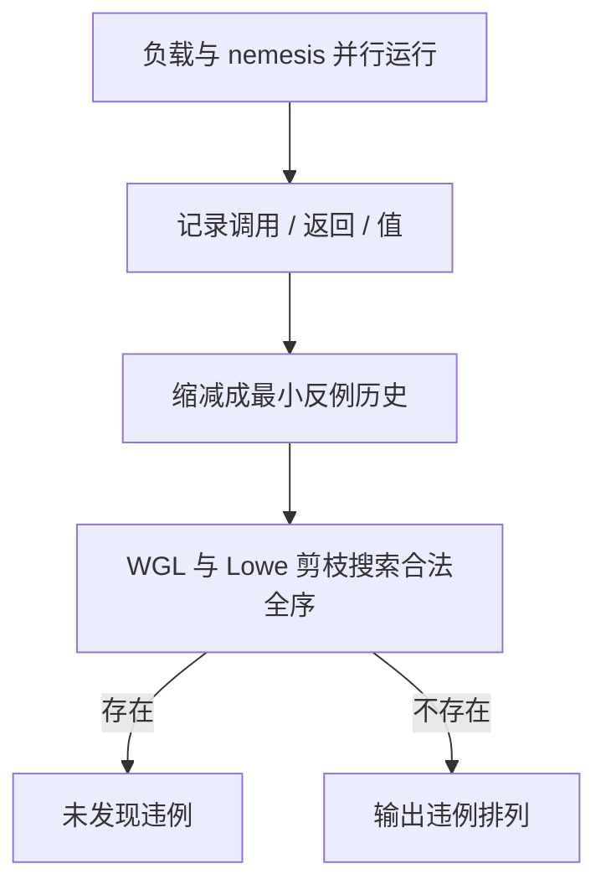
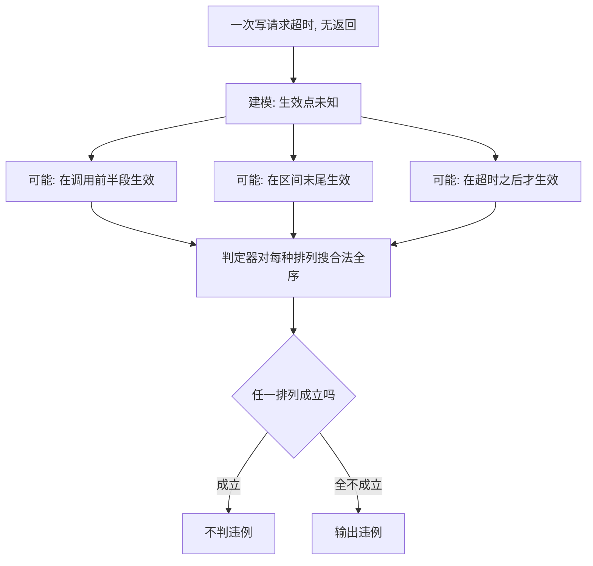

# 线性一致性的测试

实现共识的人证协议，运行共识的人证历史：把「我认为它线性一致」变成在完整历史上搜一个合法全序——可判定，但 NP 完全，于是工程全在剪枝。

<footer>—— 据 Gibbons and Korach, SIAM J. Comput., 1997 与 Wing and Gong, JPDC, 1993 整理</footer>

[上一课](/cs/con-paxos-family)把谱系与旋钮理清，也留下一张没兑现的支票：这些实现真的给出[线性一致性](/cs/linearizability)吗？主干课立过定义——线性化点落在调用与返回之间，且尊重实时先后；本课写兑现的检验工程学：历史怎么记录、判定器怎么搜、故障注入怎么把纸面协议逼出真话。

## 问题

线性一致性的定义一句话说完，检验却是搜索问题：并发区间的操作可以排成多种全序，要找的是「每读见最近写、且不破实时序」的那一种。候选全序数随操作数指数增长；Gibbons 与 Korach 给出边界：对读写寄存器历史存在多项式算法，对队列等一般对象判定为 NP 完全。工程里还有三类噪声把搜索搅得更糟：超时的操作不知道实际何时生效；崩溃重连的客户端会打破「一个客户端一个线性化点」的直觉；时钟跳变让记录下来的实时序本身不可信。直接把生产历史喂给穷举判定器，第一步就走不动。

直觉类比：线性一致性像银行只有一个柜台——不管后台有多少副本在同步，每个操作看起来都发生在调用与返回之间的某一瞬间，且所有人看到的先后顺序一致。检验器要回答的就是：这堆杂乱的历史，能不能重排出这样一个「单柜台」故事。

### 打点、缩减、判定

管线三段。打点：每个客户端记录调用、返回与值，故障注入器（分区、时钟跳变、丢包、进程暂停）与负载同时跑——没有故障注入的线性一致性测试，基本只测到无故障路径。缩减：把完整历史缩成最小反例，去掉与违例无关的操作，判定器的输入常从十万条缩到几十条。判定：Wing 与 Gong 1993 的 WGL 算法做带记忆化的深度搜索；Lowe 2017 用实时序的 FIFO 性质收紧剪枝；工程判定器再按 key 分解历史，互不重叠的操作独立检查后合成——这是把 NP 完全跑进工程的两条路。

Jepsen 历次报告的价值在公开「文档声称」与「故障下实测」的差距：线性一致性是可测的声明，也是被测出违例最多的一致性档位——测它的成本，远低于在生产事故里发现它。

## 方法

超时的建模是最要紧的决定：调用方超时不等于操作没发生——写可能在服务端任意时刻生效，历史必须把它记成「线性化点可选在区间内任意处，甚至区间之后」，少建一种可能性，误报与漏报一起出。另一类坑是档位混淆：实现声称线性一致、实际服务串行读，历史表现为偶发读旧值；先在规格里写清声明的档位再测，报告才有对照——跟随者读、快照读各自要单独注入分区来逼出行为。租约读还要单测时钟假设：注入时钟跳变，看租约重叠期是否出现两个读入口。

常见误区：初学者容易把超时的请求从历史里直接删掉、当作「没发生」。实际上写可能早已在服务端生效，只是应答没送回来——删掉它等于少建一种可能性，判定器要么误报、要么漏报。正确做法是记成「生效点可在区间内甚至区间之后的任意处」。

## 机制

NP 完全为什么还能跑：真实反例都很短，剪枝与记忆化把几十条操作的历史压到毫秒级；大规模历史靠按 key 分解分治。判定器只回答「这段历史有没有违例」，它不回答「系统是否线性一致」——后者是全称命题，测试只能证伪。于是结论的表述要诚实：通过 $k$ 轮注入了哪些故障的检验，报告的正是这些故障组合下未发现违例；没注入的崩溃组合不进结论。模型检查（TLA+）补另一头：证的是规格而非实现，实现与规格之间的锁、缓存与重试，仍要靠历史检验去扫。

数字实例：按 key 分解的威力——一百万条操作若分散在十万个 key 上，每个 key 平均只有 10 条；指数搜索只作用在每个 key 的小历史上，总开销接近线性。这就是「NP 完全也跑得进工程」的常用分治法，与剪枝、记忆化配合使用。

## 边界

本课不写形式化验证本身，不比较各家判定器的性能——选型按历史规模与数据结构形状。检验也不替代档位设计：测出跟随者读不线性不是判定器的功劳，是规格写对了的功劳。最后守住语义边界：线性一致性是单对象上的实时契约，事务与多键约束要换事务级的检查器（如 Jepsen 的 Elle 对反例模式做匹配），不能用单键历史拼凑结论。

## 小结

- 检验三段：打点记录历史、缩减反例、搜索合法全序；读写寄存器多项式，一般对象 NP 完全。
- 超时操作必须建模为「生效点未知」，否则误报与漏报一起出。
- FIFO 剪枝、记忆化与按 key 分解是把 NP 完全跑进工程的路径。
- 无故障注入的线性一致性测试价值有限；档位要先声明再测，结论按注入范围表述。
- 出处：Wing and Gong, JPDC 1993；Gibbons and Korach, SIAM J. Comput. 1997；Lowe, Concurrency and Computation 2017；Jepsen 系列报告。
