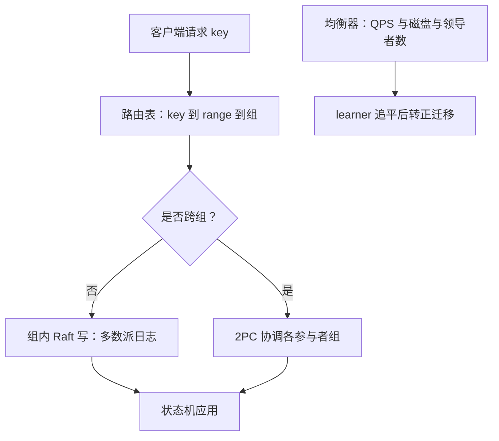
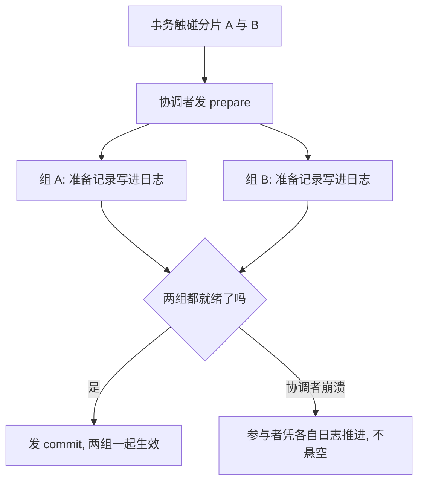

# Multi-Raft

单组共识的难题是一份日志怎么活下来；切成几千组之后，难题变成几千份日志怎么不打架——协议没有变难，秩序变贵了。

<footer>—— 据 Corbett et al., Spanner, OSDI 2012 与 Huang et al., TiDB, VLDB 2020 整理</footer>

[上一课](/cs/con-raft-implementation)把单组 Raft 的实现账单列全：落盘次序、选举与回退、三档读。缺口是容量与放置：一个领导者、一份多数派撑不起大数据量，也回答不了「数据住哪个机架」。本课写 Multi-Raft——按分片把共识复制几千份，以及切组之后冒出来的新账：分裂合并、副本迁移、心跳聚合，以及跨组一致性为什么必须回到 2PC。

## 问题

单组 Raft 有三个结构性极限。吞吐：所有写挤过一个领导者的日志，多数派 fsync 是全局串行点。容量：状态机与日志都在同一台机器上，存不下就无解。放置：副本落在哪里由初始部署定死，搬不动。切组同时解三件事：把键空间按 range 或 hash 切成分片，每片一个独立的共识组，各组分摊写入、各占各的盘、各自的副本摆不同拓扑。但切组引入了单组没有的问题：分片边界不是静态的——数据会长大会变热；几千组的选举、心跳、快照同时跑，常驻开销线性放大；更要紧的是，跨组的写没有任何顺序保证——共识只在组内给全序，两个组之间没有共同的时间线，这正是[共识与 2PC](/cs/consensus-vs-2pc) 分清过的界：共识卖高可用与组内顺序，跨组原子性要另买。

直觉类比：单组 Raft 像只有一间会议室的总公司——所有审批挤同一张桌；Multi-Raft 是拆成连锁店，每家分店自治表决（组内共识），总部只维护分店名录（路由表）。跨分店的联合活动没人天然担保，得专门请协调人——2PC 就是那个角色。

### 切、并、搬

分裂：分片超过阈值就从中点切成两个子分片，各自开新组写后续日志。合并是逆操作。迁移：把过热分片的领导者或副本搬到空闲节点，服务跟着走。三件事共享同一条纪律：任何时刻多数派不能有缺口——迁移用 learner 先追平再转正，合并前后两个组各完成各自的配置变更。

## 方法

生产系统的分片粒度是百 MiB 量级：TiKV 的 region 默认 96 MiB 触发分裂、144 MiB 是上限。路由表回答「key 在哪个组」，它自身要强一致且高可用，于是放进另一份小共识（根组或元数据服务），形成两级定位：key 到 range，range 到组。均衡器按各组 QPS、磁盘水位、领导者数量做调度：领导者迁移只换服务不搬数据，副本迁移才动盘。心跳是隐性大头：几千组共用少量连接，心跳与消息批量打包，否则每组每秒数次的 RPC 会吃光连接数与 CPU。

数字实例：5000 个组若各自每秒发 3 次心跳 RPC，就是每秒 1.5 万个请求的常驻底噪；把几百条心跳打包进一个消息后，连接数与 CPU 开销都降一个量级。这就是「心跳是隐性大头」的具体含义。

一个容易被低估的成本：每组独立的任期与快照意味着监控维度从一份日志变成几十万份——「集群健康」必须聚合成组间分位数，盯单组告警在 Multi-Raft 里没有意义。

## 机制

为什么跨组必须回到 2PC：一条事务触碰分片 A 与 B，两组的多数派只能各自承诺组内顺序，谁也不能替对方担保提交；协调者用两阶段问一遍，参与者把「准备提交」写进各自日志——日志有共识兜底，协调者崩溃后参与者仍能凭日志推进。这是主干 2PC 的阻塞问题加上共识之后的工程解，Spanner 的 Paxos 组与 TiKV 的 raftstore 都走这条路。选举风暴是 Multi-Raft 特有的账：网络抖动让几百个组同时超时重选，重选的 CPU 尖峰又拖慢幸存组；随机化各组选举相位、批量发心跳，把它压住。数量级：百 TB 数据按百 MiB 切就是百万级分片，万级到百万级组在这类系统里是常态而非特例。

常见误区：初学者容易以为共识引擎给了「整个集群的全序」。实际上每个组的 Raft 只保证组内日志全序；组与组之间没有共同时间线——A 组排好的一条写与 B 组排好的一条写，谁先谁后无从谈起。跨组要顺序，只能另买 2PC 或外部时间戳（如 Spanner 的 TrueTime）。

## 边界

本课不选分片键、不谈哈希与 range 分桶的通识；placement rules 与跨城副本的语义在地理复制课，不在这里展开。共识协议本身一行没改——每组仍是上一课那份账单，改动全在编排层。也别把 Multi-Raft 当分片的唯一姿势：Spanner 用 Paxos 组，链式复制有另一路变体，谱系对照留给下一课。

## 小结

- 切组同时解吞吐、容量、放置；每组仍是完整的单组共识，新账全在编排层。
- 分裂、合并、迁移都围绕「多数派不缺口」：learner 追平再转正。
- 路由表自身要一份共识；两级定位是这类系统的固定结构。
- 跨组原子性必须买 2PC；共识只卖组内顺序，不卖跨组时间线。
- 心跳批量与随机相位压选举风暴；监控按组分位数聚合。
- 出处：Corbett et al., Spanner, OSDI 2012；Huang et al., TiDB, VLDB 2020；TiKV 文档的分片参数。
