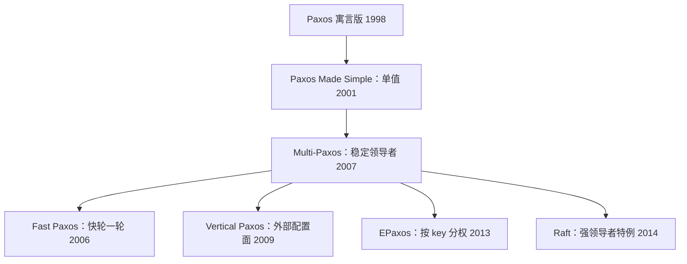

# Paxos 谱系

「Paxos」在工程里从来不是一个算法，是一族算法：领导者强度、日志语义、提交规则、配置变更，四个旋钮各拧各的——谱系不清，是 Paxos 难用的第一来源。

<footer>—— 据 Lamport, ACM TOCS 1998 与 Paxos Made Simple, 2001；Chandra, Griesemer and Redstone, PODC 2007 整理</footer>

[上一课](/cs/con-multi-raft)把共识横向切成几千份；本课回身把另一半家谱理清。主干课已分别走过 [Paxos](/cs/paxos)、[Multi-Paxos](/cs/multi-paxos) 与 [VR](/cs/viewstamped-replication)，Raft 也读到了实现层；缺的是它们之间的关系图：谁补了谁的活性洞、谁把谁特例化、每个旋钮拧到哪里。立起这张图，再读任何一篇新共识论文都只需先标四个旋钮。

## 问题

工程里说「我们用 Paxos」时，歧义至少三层。第一层，经典 Paxos 是单值协议，与「日志」之间隔着 Multi-Paxos——而 Multi-Paxos 没有一份公认的规格：Lamport 2001 的极简版与 Paxos Made Live 的工程版，在领导者租约、日志空洞、成员变更上口径并不相同。第二层，Paxos 论文没说清领导者崩溃后日志怎么恢复，实现者各自发明，正确性参差。第三层，配置变更在早期论文是空缺，后来的联合共识、Vertical Paxos、Raft 单步变更各补一洞。不立谱系，每接手一个「Paxos 实现」都要从头猜它的旋钮位。

## 方法

方法是谱系学的读法而非教程式讲法：按时间把主线一篇一篇立起来，每篇只记录三件事——它拧动了哪个旋钮、补了谁的活性或工程洞、为此付了什么代价；四个旋钮的坐标系留到机制一节收拢。这样安排的好处是增量化：此后再读任何新共识论文，只需回答「它拧了哪个旋钮」，不必重讲共识推导。

### 主线与分支

主线按时间读。1998 年《The Part-Time Parliament》用希腊议会寓言包装算法，难读而少人问津；2001 年作者用十几页重写成 Paxos Made Simple——prepare 争承诺、accept 写值，单值定音。2007 年 Paxos Made Live 补工程件：稳定领导者把 prepare 按任期摊销、只提交无空洞前缀、master 租约与快照。2006 年 Fast Paxos 拧「轮次」旋钮：无竞争时一轮通信直接学习，代价是快轮多数派更大（$3f+1$ 个接受者中快轮取 $2f+1$），有竞争退回经典两轮。2009 年 Vertical Paxos 把「谁当主」与「重配置」解耦，主由外部强一致配置面驱动。2013 年 EPaxos 把领导者旋钮拧到零：命令按 key 亲和分组，无冲突时任意副本一轮提交，广域网下省半个 RTT，代价是恢复协议的复杂度。2014 年 Raft 从另一头进：把 Multi-Paxos 特例化成强领导者——日志无空洞、只有最新日志当选、当前任期才提交——用约束换可理解性。[Zab](/cs/zab-zookeeper) 与 VR 是同族旁支，主干已读。

同一算法的两种命运：寓言版难读而少人问津，十几页的重写版成了被引最广的分布式论文之一。今天实现者口中的「Paxos」，多数指 Multi-Paxos 的某个私有变体，而不是 2001 年那份极简单值协议。

## 机制

四个旋钮给谱系一个坐标系。领导者强度：从 Raft 的唯一领导者，到 Multi-Paxos 的稳定提议者，到 EPaxos 的按 key 分权。日志语义：无空洞连续（Raft）与槽位独立（Paxos）——前者让回退与对齐有确定方向，后者允许乱序补槽但恢复协议复杂。提交规则：「当前任期多数派才提交」与「任意轮次证书」——前者防住旧任期条目自提交的陷阱。配置变更：联合共识、单步变更、Vertical Paxos 的外部配置面，三种写法都要保相邻多数派相交。读任何实现，先问四个旋钮的位置再谈正确性——工程里大多数「Paxos 之争」其实是旋钮没对齐。

## 边界

多数派相交与 FLP 不重证（主干与 [FLP 课](/cs/flp-impossibility)已做）；拜占庭一族的 PBFT 不进本谱系；Fast Paxos 的完整 quorum 代数与 EPaxos 的恢复正确性证明是各自论文的题，本课只定位旋钮。也别把谱系读成进化链：EPaxos 不是 Raft 的替代，Fast Paxos 也未被淘汰——旋钮组合各有适用面，选型按延迟分布与运维能力，不按新旧。

## 小结

- Paxos 是一族算法；领导者强度、日志语义、提交规则、配置变更是四个旋钮。
- 主线：1998 寓言版、2001 单值极简、2007 工程化 Multi-Paxos，Fast、Vertical、Egalitarian 各拧一个旋钮，2014 Raft 特例化强领导者。
- Multi-Paxos 没有公认规格；接手实现先标旋钮位，再谈正确性。
- Raft 的三条额外约束换实现秩序；EPaxos 的零领导者换广域 RTT，各付各的复杂度。
- 出处：Lamport, TOCS 1998 与 Paxos Made Simple, 2001；Chandra, Griesemer and Redstone, PODC 2007；Lamport, Fast Paxos, Distributed Computing 2006；Moraru et al., SOSP 2013；Ongaro and Ousterhout, ATC 2014。
