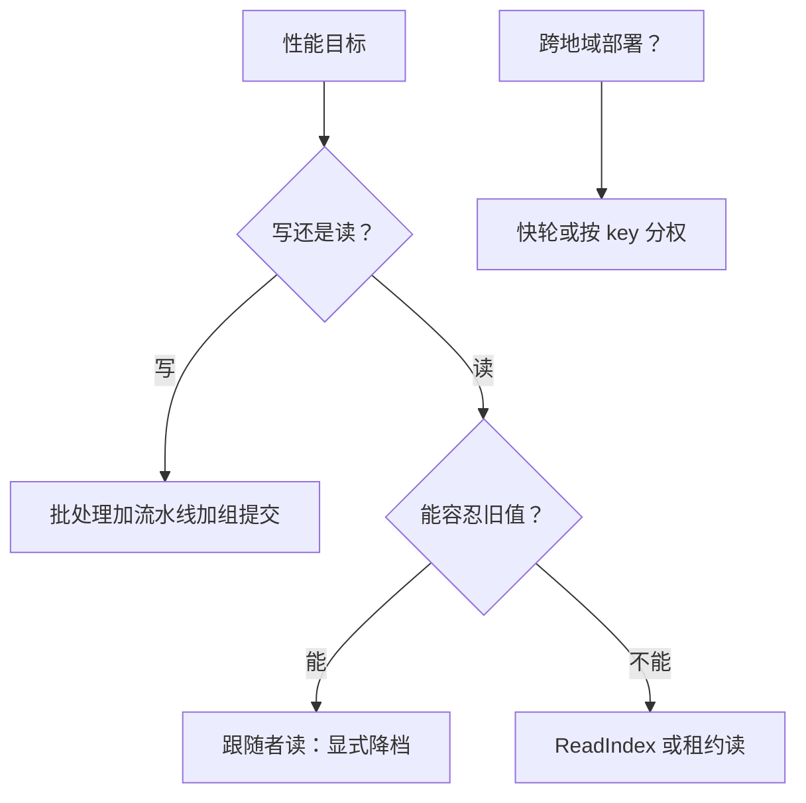

# 共识的性能优化与收束

一次提交至少要等一轮多数派确认，这是共识的利率下限；全部优化的本质不是推翻它，而是把每一轮装满、把读请出关键路径、把假设写进合同。

<footer>—— 据 Lamport, Fast Paxos, Distributed Computing, 2006 与 Ongaro 博士论文, 2014 整理</footer>

[上一课](/cs/con-etcd-case)把合同读进真实产品，本课程也到了结账的地方：把七课的优化手段排成一张不碰安全论证的决策表，划清边界——本课程到此收束。

## 问题

优化共识最常见的错误是动安全：省一次 fsync、读不加确认、跳过任期限定，每一条都在拿线性一致换速度而不声明档位。缺口因此是两份清单：一份是「不碰安全」的优化集合，标明每个手段吃的是哪份资源——盘、RTT 还是 CPU；另一份是「动了安全」的集合，标明它实际卖掉的是什么档位。分不清这两份清单，性能工作就变成一致性税的走私。

## 方法

方法是先立下限、再排手段：把一轮多数派确认这块地板念清楚，然后把七课的优化手段按路径——写、读、拓扑、活性——填进一张决策表，每个手段标注它吃的是盘、RTT 还是 CPU，动了安全的还要标注卖掉的是哪一档一致性。查表按性能目标走，不按论文顺序走。

### 决策表

按路径读表。写路径：批处理攒命令摊薄一轮多数派 fsync，吞吐换延迟；流水线不等 ack 发下一条，用 matchIndex 兜住；日志存储顺序写加组提交；快照与 learner 让追赶不占正常复制带宽。读路径按档位：可容忍旧值走跟随者或串行读；要线性一致走 ReadIndex——一轮心跳确认、零盘操作；租约读免确认，但把时钟假设写进合同。拓扑：跨地域部署时，要么 Fast Paxos 式快轮——无竞争时一轮学习，快轮多数派更大（$3f+1$ 中取 $2f+1$）——要么 EPaxos 式按 key 分权省 RTT；容量问题回 [Multi-Raft](/cs/con-multi-raft)。活性：PreVote 与 CheckQuorum（第一课）防隔离节点搅局，[领导者选举与脑裂](/cs/leader-election-split-brain)的教训在部署层兑现。

一条换算：批大小 $b$、多数派 RTT $r$、单盘 fsync 延迟 $d$，单组写吞吐上界约 $b/(r+d)$。加大 $b$ 线性提升吞吐，但批大到心跳量级就开始拖尾延迟——吞吐优化的每一分都在尾延迟上记账。

## 机制

下限要念清楚：$N=2f+1$ 副本时，一次提交的延迟下限约一轮 RTT 加一次 fsync——落在最快的 $f+1$ 个副本上；线性一致读的下限是一轮多数派确认，除非用租约把确认摊销掉。Fast Paxos 证明快轮省的只是「竞争消除时」的一轮；EPaxos 省的是领导者所在半程的 RTT；所有手段都没有越过下限，越过去的都在另一个一致性档位上。于是收束地图也清楚了：第一课的实现账单是安全的前提；第二课把共识横向复制；第三课给出设计空间的四个旋钮；第四课用历史检验兑现声明；第五课把日志接上状态机；第六课看合同装成产品；本课把账结在两条下限上。往上是跨组原子性与隔离级别的实现，起点是[共识与 2PC](/cs/consensus-vs-2pc)；往下是日志存储与网络工程——都另有课程，共识深化的合同在这里封卷。

## 边界

本课程没有覆盖的地带照例交代：拜占庭与 BFT 的吞吐账（PBFT 一族）另有专课；日志存储的文件系统与 IO 语义、传输层工程不展开；形式化验证只在检验课点到 TLA+ 与实现的分层。性能优化的边界也要收口：每一项优化都该能在前几课找到它的安全出处——找不到的，就是走私；每一条降档都应该在合同里声明——没声明的，就是负债。

## 小结

- 决策表分两栏：不碰安全的优化集合与声明降档的集合，混栏即走私。
- 写路径：批处理、流水线、组提交、快照追赶；读路径：ReadIndex 或租约，串行读显式声明。
- 下限念清楚：一轮多数派确认是提交延迟的地板；租约是摊销，不是取消。
- 广域优化换的是 RTT 结构，不是一致性档位：Fast Paxos 与 EPaxos 各付各的 quorum 与恢复成本。
- 七课收束：实现前提、横向复制、设计旋钮、历史检验、状态机接缝、产品合同、本课的下限账。
- 出处：Lamport, Fast Paxos, Distributed Computing 2006；Ongaro 博士论文 2014；Moraru et al., SOSP 2013；各课随课标注。
