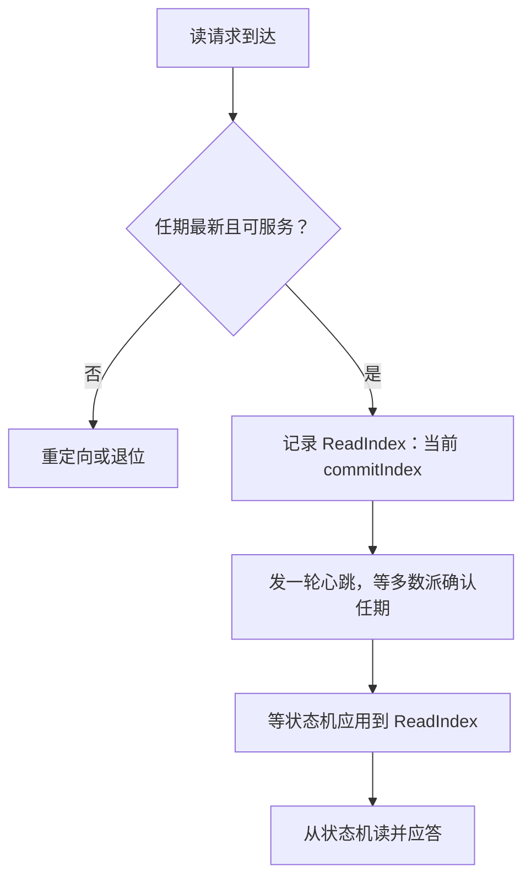
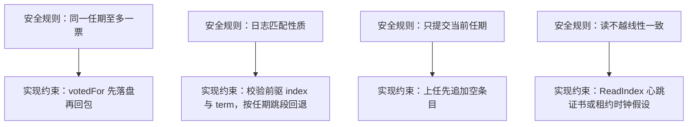

# Raft 的实现细节

论文证明的是安全规则在什么模型下成立；实现要回答的是这些规则落在磁盘、时钟与消息次序的哪一行——两份账单少对一行，安全就成了假设。

<footer>—— 据 Ongaro, Consensus: Bridging Theory and Practice（博士论文，2014）与 Ongaro and Ousterhout, USENIX ATC 2014 整理</footer>

[上一课](/cs/stream-systems-map)给「流处理」收束：Flink 的状态归作业、恢复走快照重放，Kafka Streams 的状态归实例、changelog 即 WAL，恰好一次的两条路线各押一种机制——语义模型先于引擎。两条路线都把注押在日志上；主干课的 [Raft](/cs/raft) 把任期、日志匹配与「只有最新日志者能当选」钉成安全规则，[成员变更与快照](/cs/raft-membership-snapshot)又把配置与压缩并进日志，但那条主干停在规格层。本课是「分布式共识深化」的第一课，下到实现：哪些状态先落盘再回包、选举超时怎么取、日志不一致怎么回退、读请求不进日志仍线性一致。后课默认这些细节已经在手。

## 问题

主干课的安全论证有一个隐含前提：崩溃重启后，节点不能在同一任期投两票。落到实现里是一条硬规则：currentTerm、votedFor 与收到的日志条目必须在应答 RPC 之前写入持久存储。顺序反了，多数派就是假的：三个节点回了 ack 却没落盘，断电重启后各自忘了那次接受，领导者以为已提交，日志在重启后分叉。实现细节因此不是优化项，而是安全论证的前提。第二个缺口是读路径：论文把提交定义在日志上，客户端要读的却是状态机；不经过日志的读怎样不越[线性一致性](/cs/linearizability)的界，主干只留一句「ReadIndex 或租约」，账要自己算。

### 持久态、易失态与次序

持久态只有三样：currentTerm、votedFor、log。易失态包括 commitIndex、lastApplied 与各跟随者一份的 nextIndex、matchIndex。次序合同有两条：RequestVote 先持久化任期与投票再回包；AppendEntries 先把条目落盘再回 ack，领导者数到多数派 ack 才推进 commitIndex。选举超时取随机区间，量级服从 broadcastTime $\ll$ electionTimeout $\ll$ MTBF：ATC 论文的参考值是广播 0.5–20 ms、超时 150–300 ms；随机跨度太小，双选重演，跨度太大，故障切换拖长。给个数字实例：取超时区间 150–300 ms，三个节点各随机取到 180、240、290 ms——最早的 180 ms 先发起选举，其余 60 毫秒内就会投票，冲突自然消解。若把区间缩成 150–160 ms，两个节点取到 155 与 156 ms 就几乎必然撞车，选出又罢免、反复横跳。

日志回退不要逐条退：AppendEntries 被拒时带上冲突处的任期号，领导者直接跳到该任期第一条，一次 RPC 跨过一整段冲突——论文的逐条递减只是正确性基线，不是实现。

## 方法

读路径三条路，价格不同。跟随者读：跟随者直接答，零成本，但读到可能落后的状态——文档必须声明这不是线性一致。ReadIndex：领导者记下当前 commitIndex，发一轮心跳向多数派确认自己未被罢免，等状态机应用到该位置再答；全程无盘，代价一轮 RTT。租约读：把「心跳新鲜」当作任职租约，租约内读免掉心跳确认，代价是时钟假设——漂移超过租约余量，新旧领导者可能在重叠窗口里同时服务读。工程实现通常三档并存，按请求声明档位，不给系统一个含糊的「强一致」。

写路径的两个性能件不影响安全：批处理把多条客户端命令攒进一次 AppendEntries，摊薄一轮多数派 fsync；流水线不等上一条 ack 就发下一条，用 nextIndex 与 matchIndex 兜住乱序。配套两个只买活性的补丁：PreVote 先以旧任期发预投票，问「我的日志够新吗」，避免被分区的节点自增任期回来搅乱集群；CheckQuorum 让领导者定期确认多数派仍联系得上，否则退位，把不可用及时变成重新选举。

## 机制

这些细节为什么恰好是这些：安全论证每一条都对应一处实现约束。「同一任期至多一票」对应 votedFor 落盘；日志匹配性质对应前驱 index 与 term 的校验和冲突回退；「只提交当前任期」对应领导者上任后先追加的空条目——它把旧任期条目带进当前任期的多数派。那条「空条目」可以想象成新领导上任先签的一份空白公文：它自己不含数据，但只要它被多数派确认提交，同一日志里排在它前面的旧任期条目就一并被「捎带」进了当前任期的提交证书——绕开了「旧任期条目可能永远差一票」的提交陷阱。初学者容易以为空条目是浪费，实际它是把提交规则接起来的那颗销钉。少装任何一件，对应的安全性质就从定理退回愿望。读路径同理：ReadIndex 的心跳确认把「我没有被罢免」从内存断言升级为多数派证书；租约读用有界时钟把证书延到下一次心跳。

崩溃恢复按同一逻辑审：重启后先读持久态，恢复 votedFor 与日志，再从快照与重放重建状态机进度——安装快照即强制对齐（成员变更与快照课已立），实现里对应 InstallSnapshot 的流式传输与清旧日志；漏了任一步，节点带着错误记忆参与下一轮多数派。

初学者容易以为「先回 ack、异步再落盘」只是性能优化的小取舍，实际上这直接拆掉多数派的意义：三个节点都回了 ack 却都没写盘，断电重启后各自忘了那次接受，领导者却已把 commitIndex 推进——日志在重启后分叉，「已提交」的数据凭空消失。所以次序合同是安全前提，不是优化项。

## 边界

本课不重证安全（主干已证），不横向切组（下一课），锁与协程细节留给 etcd 走读。规格与实现还有一层差距：TLA+ 里消息与状态迁移原子，实现里交错，检验它属于线性一致性测试课，不是把定理重读一遍。性能总量账——批到多大、读到哪一档——留到本课程最后一课收束。

## 小结

- currentTerm、votedFor、日志先落盘再回包；多数派 ack 的真实性由这条次序保证。
- 选举超时按 broadcastTime $\ll$ electionTimeout $\ll$ MTBF 取随机区间；冲突回退按任期跳段。
- 读三档：跟随者读声明降档，ReadIndex 一轮心跳确认，租约读吃时钟假设。
- 批处理与流水线摊薄 fsync 与 RTT；PreVote 与 CheckQuorum 只买活性，不碰安全。
- 出处：Ongaro 博士论文 2014（读路径、PreVote、批处理）；Ongaro and Ousterhout, USENIX ATC 2014。
