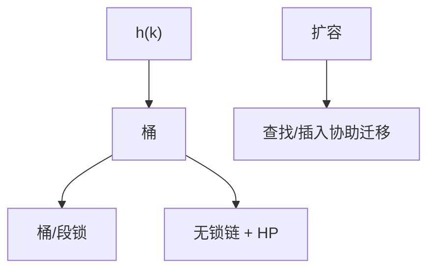

# 并发哈希表

桶级锁、分段锁、或无锁链表/CAS 槽：扩容要把迁移与查找线性化，不能当单线程再散列。

<footer>—— 据 Herlihy and Shavit, The Art of Multiprocessor Programming；Lea, Concurrent Hash Map 设计笔记；Michael, High Performance Dynamic Lock-Free Hash Tables and List-Based Sets, PODC 2002 整理</footer>

[上一课](/cs/hazard-pointer) 给了节点回收。[链式与开放寻址](/cs/chaining-open-address)、[Robin Hood 与布谷](/cs/robin-cuckoo) 是串行放置。[并发跳表](/cs/concurrent-skip-list) 保序。本课不 splay。缺口是无序并发 `map`：查找热、插入扩容。

## 问题

单锁哈希表随核数塌缩。分段：每段一把锁，期望冲突减。桶锁更细。无锁：每桶 Michael 无锁链表或 CAS 槽位，扩容用新表 + 迁移标志，查找可能要看两代表。缺口是**扩容与 get/put 交错时仍线性化**，以及 size 计数的近似 vs 精确。

Doug Lea 的 `ConcurrentHashMap`（分段 → 后来 bin + treeify + 协助迁移）是实践课。Michael PODC 2002 无锁哈希。Herlihy–Shavit 教材有整章。

## 方法

查找无锁或持桶锁只读。插入：锁桶或 CAS 链头。扩容：分配更大数组，线程 put 时顺便迁移一个桶（协助），避免停世界。键相等与哈希必须稳定。迭代弱一致：可以不见刚插入的，合同要写。

与 HAMT：持久 HAMT CAS 根适合多读；就地并发表吞吐常更高。与 ART：有序内存索引另一条线。

## 机制

假共享：相邻桶锁应填充。负载因子触发扩容，与串行相同但阈值要考虑并发插入爆发。不要在教学里要求复现数据竞争当作业。

读多写少、读侧几乎无原子：RCU 链表哈希下一课更合适。

## 边界

本课不把某语言标准库源码逐行当课程。布谷并发插入踢链更难，点名。RCU 友好结构强调写复制或发表指针。

后课默认：通用并发字典可用分段/无锁哈希。读优化链表用 RCU。

## 小结

- 并发哈希：细锁或无锁桶，扩容要协助迁移。
- 迭代常弱一致；回收用 HP/epoch。
- 读多写少可改 RCU 发表。
- 出处：Herlihy and Shavit；Lea；Michael, *PODC*, 2002。
