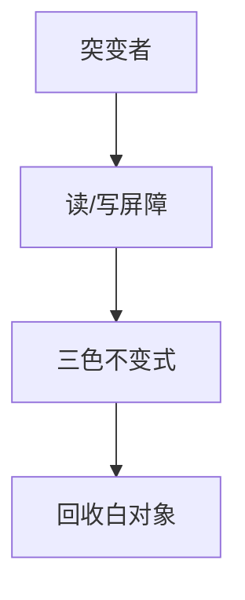

# 并发与增量 GC

增量把标记切成小片与突变者交错；并发让标记与用户线程真正并行。三色不变式靠读/写屏障维持，否则漏标或悬浮。

<footer>—— 据 Dijkstra et al., On-the-Fly Garbage Collection；Steele；Jones 手册；G1/CMS 实践对照整理</footer>

上一课[写屏障与卡表](/cs/write-barrier-card-table) 给了记录写入的钩子。缺口是**缩短停顿**：增量/并发标记。本课钉三色（白灰黑）与屏障选择，分代晋升下一课。不把某个 JVM 收集器当唯一理论。

## 问题

Stop-the-world 复制简单，延迟差。并发：突变者同时改图。Dijkstra：写屏障维持不变式。现代：SATB（snapshot-at-the-beginning）或增量更新。缺口是**与突变者的合同**，不是卡表字节。

增量：STW 但切片，仍要世界一致的根。

### 并发 GC 不是「无暂停」

通常有短 STW（根扫描、再标记）。无暂停要更强（Azul、Shenandoah 的进步点名），代价更高。

Dijkstra, Lamport, Martin, Scholten。Yuasa SATB。CMS/G1/Shenandoah。Jones 手册并发章。

## 方法

三色：黑=扫完，灰=待扫，白=未访问。结束时白是垃圾。屏障：防止黑指向白而不灰。实现选 SATB 或增量更新。

与 JIT：安全点、load 屏障（Brooks/LVB）影响每一条指针读。

## 机制

浮动垃圾：SATB 可能把本轮已死当活，下轮收。吞吐换延迟。不要在屏障里分配而无 TLAB 小心再入。

验证：漏屏障是最毒的 bug。

## 边界

本课不写 G1 region 全文。后课默认：低延迟靠屏障+三色。下一课分代假设与晋升。

也不把并发 GC 当数据库 MVCC 课。

## 小结

- 增量/并发用三色+屏障与突变者共存。
- 仍常有短暂停；浮动垃圾换延迟。
- 与卡表分代正交，可组合。
- 出处：Dijkstra et al.；Jones 手册；Yuasa SATB。
