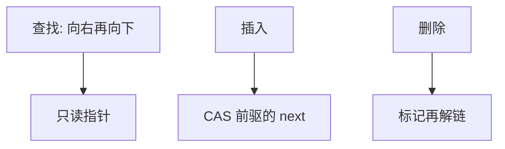

# 并发跳表

跳表没有必须旋转的根；各层前向指针可以用 CAS 接线，查找甚至常常无锁只读。

<footer>—— 据 Pugh, Concurrent Maintenance of Skip Lists, 1990；Herlihy and Shavit, The Art of Multiprocessor Programming 整理</footer>

[上一课](/cs/order-statistic-tree)的树要旋转，旋转碰祖先，细粒度锁难。[跳表](/cs/skip-list) 的形状是局部接线。[无锁与 ABA](/cs/lockfree-aba) 已警告 CAS 位型。本课不重讲随机层高期望。缺口是并发跳表：查找无锁遍历，插入删除对前驱指针 CAS（或分层锁）。

## 问题

共享有序映射：红黑全局锁太粗；无锁 BST 要帮旋转与 ABA。跳表层间独立：插入先串底层再从低到高挂快进指针；删除标记再解链。缺口是**线性化点落在某层指针从旧后继改到新后继**，查找要能容忍「看见正在插入的半成品」。

Java `ConcurrentSkipListMap` 是实践标杆之一。Pugh 1990 技术报告写了并发维护。Herlihy–Shavit 教材有整章跳表。

## 方法

查找：从高层向右向下，读指针；若实现用标记位表示「节点已删」，查找跳过标记节点。插入：找到每层前驱，CAS 前驱的 next；失败则重找。删除：先逻辑删（标记），再物理摘指针，避免查找走到野指针。

与[Treap](/cs/treap)：期望对数同类，并发时跳表少旋转。进度：无锁查找常见；插入可能锁或 CAS 重试，活锁要限次。

## 机制

层高仍插入时随机，与并发独立。ABA：节点复用时 next 或标记可能骗过 CAS，回收用 hazard / epoch，后课再钉，本课承认「节点不能立即重用」。内存序：发布节点内容先于把指针 CAS 进表，见[原子 RMW](/cs/atomic-rmw)。

不要在本课写可运行的竞态 exploit；只写结构。

## 边界

本课不把完整无锁证明写完，不引入 skip list 的确定性变体。堆的可并合同与跳表无关：下一课左偏树与配对堆，为优先队列减键与合并做准备。

后课默认：并发有序映射可用跳表。可合并堆从左偏与配对开始。

## 小结

- 并发跳表：查找只读，更新 CAS 或分层锁。
- 删除常分标记与摘链；注意 ABA 与回收。
- 下一课转向可并堆，不是再一层跳表。
- 出处：Pugh, 1990；Herlihy and Shavit。
