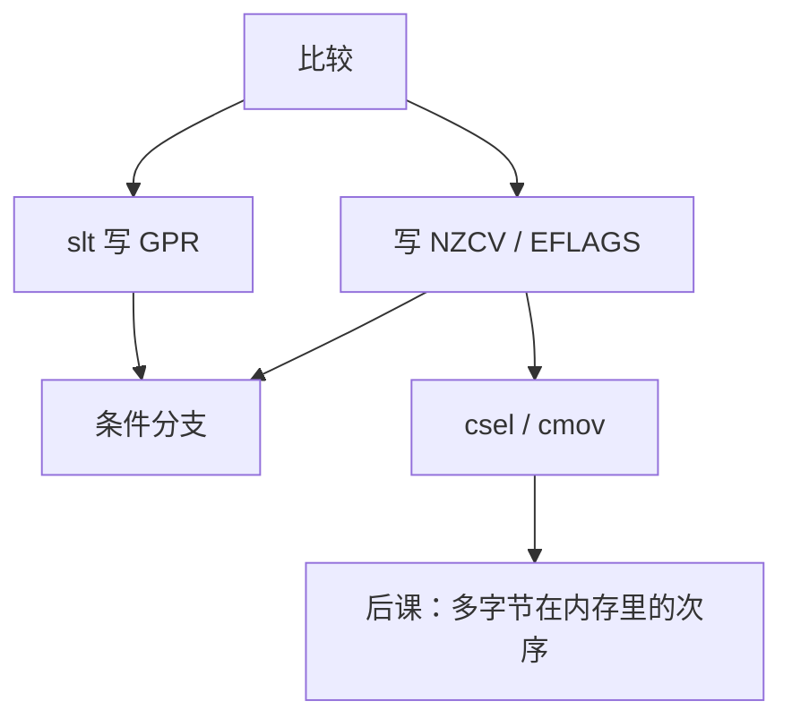

# 条件码与谓词执行

  
比较的结果可以藏进 NZCV / EFLAGS，也可以写成 GPR 里的 0/1；谓词把短分支收成选路，避免前端为一条 `if` 付冲刷。

  <footer>—— 据 ARM Architecture Reference Manual；Intel SDM；The RISC-V Instruction Set Manual；Hennessy and Patterson, CA:AQA 整理</footer>

[上一课](/cs/bit-manip-ext)的 `min`/`clz` 写出的是寄存器值。[AArch64](/cs/aarch64-isa) 已点名 NZCV，[ARM 对 RISC-V](/cs/arm-vs-riscv) 把「条件码 vs 比较进寄存器」留到本课。缺口是 **标志位与谓词**：谁写、谁读、如何消掉短分支。

## 问题

x86：多数整数运算更新 EFLAGS（ZF/SF/OF/CF）；`jcc` 与 `cmov` 读它们。ARM：可选 `S` 后缀写 NZCV，`b.cond` / `csel` 消费。RISC-V：无条件码，`blt` 直接比较两个 GPR，`slt` 把布尔写进寄存器。缺口不是再介绍分支指令，而是**隐式标志堆 vs 显式比较**对流水线与编译器的后果。

谓词：用布尔选结果而不跳转。部分谓词是 `cmov`/`csel`；A32 曾给多数指令条件域；Itanium 把谓词寄存器做成常规。 [RVV](/cs/rvv-vector) 的掩码是向量谓词，本课对照标量。

### 谓词不是「取消分支预测」

长偏置分支仍该跳。谓词消灭的是**短、难预测**的 `if`，并可能拉长数据依赖、多执行两边。把 NZCV 当预测器状态，下一课 [gshare](/cs/gshare-predictor) 会对不上：预测器看的是分支历史，不是条件码 CSR。

ARM ARM 的 PSTATE 与 CSEL。Intel SDM 的 Jcc/CMOV 与 EFLAGS。RISC-V 无标志是刻意选择。CA:AQA 讨论谓词与条件移动。

## 方法

编译器：若 ISA 有 `csel` 且两边都便宜，发条件选；否则发比较+分支，把方向交给前端。RISC-V 用 `slt`+掩码或分支；B 扩展的 `min` 是谓词的代数特例。x86 部分标志改写曾造成 stall，微结构用合并与重命名缓解——那是后课乱序，本课只要求「标志是额外的写口」。

与 [fence](/cs/fence-instructions)：条件码是核内控制状态，不参与多核内存序。

## 机制

ISA 对照到这里，控制流接口已经分叉：ARM/x86 的隐式 CC 让一条 `sub` 同时服务算术与后续 `b.eq`；RISC-V 把布尔留在 GPR，译码与重命名少一个标志堆。下一课大小端处理的是**数据在内存中的字节序**，与「比较结果放哪」正交，但 ABI 会同时规定两者。

## 边界

本课不讲 Itanium 编译器全集，不把 GPU 的 divergence 当标量谓词。不列全部 `jcc` 助记符。不进入数据库 SQL 谓词下推。

后课默认：x86/ARM 用条件码；RISC-V 比较进寄存器或直接分支；`cmov`/`csel` 是部分谓词。下一课大小端。

## 小结

- 条件码是隐式布尔；RISC-V 选择显式 GPR。
- 谓词用选路换短分支，不取消预测器。
- 向量掩码已在 RVV，本课钉标量。
- 出处：ARM ARM；Intel SDM；RISC-V ISA；Hennessy and Patterson, CA:AQA。
