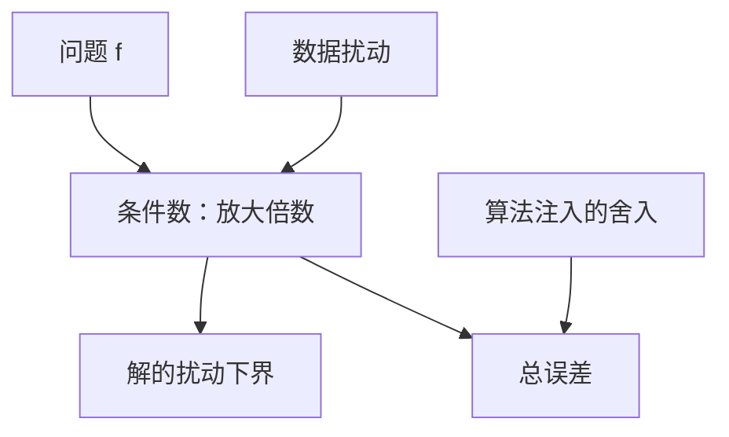

# 条件数

条件数度量问题本身：输入的相对扰动能把输出相对地放大多少；它不关心你用哪一种算法去解。

<footer>—— 据 Higham, Accuracy and Stability of Numerical Algorithms；Trefethen and Bau, Numerical Linear Algebra 整理</footer>

上一课[舍入误差如何传播](/cs/fp-error-propagation)把每步 $\mathrm{fl}$ 写成 $(1+\delta)$。本课不重推 $\gamma_n$，也不从范数公理课另起。缺口是：机器注入的扰动已经有记号了，**数据里原本就有的扰动、以及问题把扰动放大的倍数，还没有名字**。没有条件数，就无法判断「位数全丢」究竟该怪算法还是该怪问题。

## 问题

把问题看成映射 $f$：数据 $x$ 映到解 $y=f(x)$。相对条件数是输出相对变化与输入相对变化之比，在扰动趋于 0 时的上确界。对可微标量，$|f'(x)|\,|x|/|f(x)|$ 给出一阶估计。缺口因此不是再写一遍舍入模型，而是**把 $f$ 的敏感度从实现里抽出来**。同一 $f$ 可以用稳定或不稳定的算法来求；条件数只看 $f$。

线性方程 $Ax=b$ 的 $f$ 是「给定 $A,b$ 求 $x$」。后课矩阵范数会把这条写成 $\kappa(A)=\|A\|\,\|A^{-1}\|$。本课先在标量与一阶图像上建立定义，避免一上来陷入范数选择。求根、插值同样有各自的 $f$；龙格现象里插值映射可以极病态，那是最后一课。

### 病态不是「算法写错了」

$\kappa$ 大表示精确算术下数据一动解就大动。换高精度、换主元，都无法把问题变成良态；最多把算法自己的注入压下去，让总误差接近条件数给出的下限。把病态当成 bug，会去「调算法」而拒绝承认测量数据配不上这个 $f$。相反，$\kappa$ 接近 1 仍可能因不稳定算法丢掉所有位数。

Trefethen and Bau 把条件数与后向稳定并列成数值线性代数的两根轴。Higham 第 1 章区分问题与算法。本课不把 Wilkinson 的完整矩阵条件理论写完，只留定义与分工。

## 方法

标量：$\kappa\approx |xf'(x)/f(x)|$。减法 $f(a,b)=a-b$ 在 $a\approx b$ 时 $\kappa$ 相对输出可以很大——这是消去课的问题侧。线性方程组：后课用矩阵范数精确写 $\kappa(A)$；本课先记住「$A$ 接近奇异则 $\kappa$ 大」。求值多项式在特定基下也可以病态，即使根分离良好。

经验规则：若 $\kappa\approx 10^k$，相对输入误差 $10^{-d}$ 可能只剩 $d-k$ 位可靠。这是数量级，不是定理；范数与扰动结构会修正它。

相对与绝对条件要分开：接近零的输出用相对误差可以人为变大，绝对值其实稳定。选择哪一种取决于应用把什么当「准」。线性方程通常用相对；求一个可能为零的量要用绝对或混合。后课矩阵范数把 $\kappa$ 变成可算的 $\|A\|\|A^{-1}\|$；本课的标量图像已经够用来读「放大多少位」。算法课的合格线始终是：注入的后向误差约 $u$，前向大约 $\kappa u$，不要无故平方 $\kappa$。

## 机制

条件数把「能从数据里读出多少解的信息」量化。测量、离散化、把实数输入成浮点，都是数据扰动。算法再叠加舍入。后课后向稳定说：好算法表现得像「只扰动了数据一点再精确求解」；于是总相对误差约 $\kappa$ 乘上机器 $\varepsilon$ 量级。这就是两课必须分开的原因：一个乘在 $f$ 上，一个乘在实现上。

线性映射的 $\kappa_2$ 等于最大与最小奇异值之比，几何上是单位球被拉成椭球后的轴比。缩放一行可以改 $\|A\|$ 而不改真正的解敏感度，所以比较矩阵「谁更病态」前要先问范数与平衡。非线性 $f$ 的条件随点而变：根附近 $f'$ 接近 0 则求根病态，即使牛顿每步的线性系看起来良态。插值课会看到采样点一变，$\kappa$ 可以差指数级。本课先把「放大倍数属于 $f$」这句话钉死，后面每一课的算法合格线都是：不要在 $\kappa$ 给出的下限之上再糟一个数量级。

## 边界

本课不选矩阵范数、不证 $\kappa(A)=\|A\|\,\|A^{-1}\|$。下一课[前向稳定与后向稳定](/cs/forward-backward-stability)定义算法好坏。后课默认：条件数属于问题；良态仍可能被坏算法毁掉；病态不能靠换主元治愈。

## 小结

- 条件数是 $f$ 对数据扰动的相对放大，与算法无关。
- 病态给出误差下界；稳定算法把注入压到接近这个下界。
- 减法、近奇异线性系、某些插值都是典型病态 $f$。
- 下一课用前向/后向误差判断算法。
- 出处：Higham；Trefethen and Bau。
