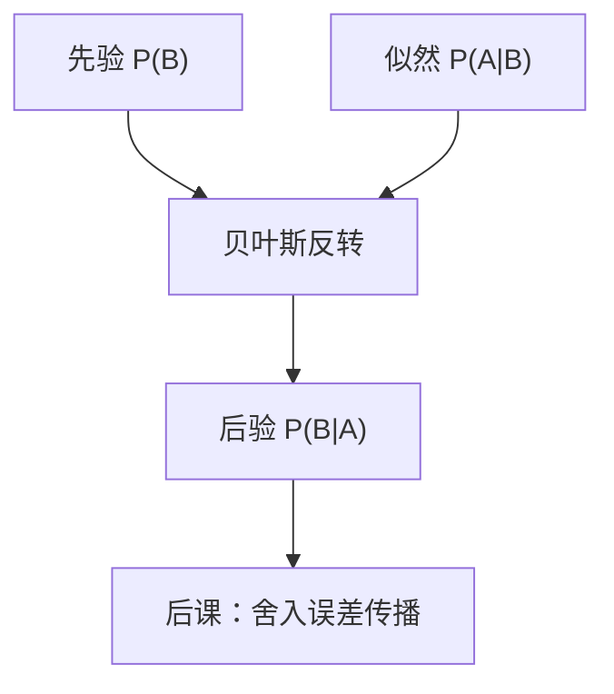

# 条件概率与贝叶斯

看见 $B$ 之后 $A$ 的权重，是把质量限制在 $B$ 上再归一化；贝叶斯把「果的似然」翻成「因的后验」。

<footer>—— 据 Rosen, Discrete Mathematics and Its Applications；Shannon, 1948 整理</footer>

上一课[期望与线性性](/cs/expectation-linearity)钉死了指示变量与无独立的求和。[离散概率](/cs/discrete-probability)已定义 $P(A|B)=P(A\cap B)/P(B)$，并说贝叶斯是改求和次序。本课不重写 $|\Omega|$，也不从因果哲学另起。缺口是：定义还不是计算步骤。误码、检验、后课信道，要把 $P(\text{发送}| \text{接收})$ 从 $P(\text{接收}| \text{发送})$ 翻出来，并避免忽略先验。

## 问题

全概率：划分 $\{B_i\}$ 时 $P(A)=\sum_i P(A|B_i)P(B_i)$。贝叶斯：

$$
P(B_j|A)=\frac{P(A|B_j)P(B_j)}{\sum_i P(A|B_i)P(B_i)}.
$$

缺口因此不是新的线性性，而是**反转条件方向**，以及分母里必须把所有假设加总。先验 $P(B_j)$ 很小则即便似然大，后验也可以小——基础比率。熵课的 $H(X|Y)$ 现在是：给定 $Y$ 之后，在条件分布上再算上一课那种期望；互信息是平均少了多少不确定。本课不把贝叶斯网展开。

信息与离散主干到此结束。下一课改做[舍入误差如何传播](/cs/fp-error-propagation)：浮点已经会表示，现在跟踪每步舍入。CMOS 反相器更后才把判决做成电路。

### 似然不是后验

$P(\text{数据}|\text{假设})$ 与 $P(\text{假设}|\text{数据})$ 同名不同向。把阳性检出率当成患病率，是丢掉先验。也不把条件独立写成「看起来没关系」：定义仍是乘积公式。

Rosen 用全概率与贝叶斯做有限求和。Shannon 的条件熵是条件分布上的 $H$。第一课的判决是确定性阈值；这里的条件是概率权重的再分配。

## 方法

写出假设划分与观测。填似然 $P(\text{观测}|\text{假设})$ 与先验，归一化得后验。链式法则 $P(A\cap B\cap C)=P(A)P(B|A)P(C|A\cap B)$ 用于拆联合，与[联合熵](/cs/mutual-information)的链式同形、对象不同（一个是概率，一个是熵值）。

## 机制

后课比特翻转模型：$P(\text{收}1|\text{发}0)$ 是信道；译码是后验最大或最近邻（几何课已给后一条）。哈希「给定槽看键」很少用贝叶斯；误阳检验常用。期望 $\mathbb{E}[X]=\mathbb{E}[\mathbb{E}[X|Y]]$（全期望）是线性性在条件分布上的用法，本课点名，不把条件期望当新测度。

## 边界

本课不引入连续密度、共轭先验、MCMC。大模型栏的 token 条件分布是另一张表，本栏不重写 Transformer。金融栏的测度换元不进来。

后课默认：有限对象上条件即限制后归一化；反转必须带先验。数值计算从下一课跟踪舍入开始；比特的物理实现更后才到反相器。

## 小结

- 条件是限制在观测上再归一化；贝叶斯反转似然与先验。
- 全概率把划分拆开；忽略基础比率会把似然当成后验。
- 信息与离散课结束；下一课跟踪浮点舍入如何传播。
- 出处：Rosen；Shannon, 1948。
