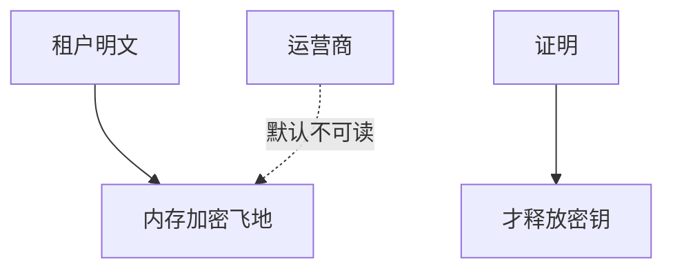

# 机密计算

机密计算承诺：云运营商看不见客户明文内存。实现靠 TEE、内存加密与证明。合同要写清谁是 TCB：CPU 厂商、主机固件、飞地代码。

<footer>—— 据 Confidential Computing Consortium 的定义陈述；对照 Costan–Devadas；NIST 对 TEE 的讨论</footer>

## 定位

上一课[TEE](/cs/tee-sgx-trustzone)给硬件盒子。缺口是**云威胁模型**：hypervisor 好奇。本课把产品叙事钉成 TCB 清单，不写打穿虚拟机的步骤。

后课默认已经读完本课钉下的合同，只补差，不从该领域第一性原理重开。

## 问题

磁盘加密挡不了运行中内存。机密虚拟机把客户内存对宿主管员加密。缺口是证明与密钥释放策略：证明失败则不交密钥。

### 不是零泄露

侧信道、嵌套、设备直通可漏。合同不是营销词。

CCC。远程证明下一课专收度量与报价。

## 方法

列 TCB：CPU、固件、VMM 最小化、客户飞地。对照 HSM。下一课远程证明。

图中节点是本课的机制骨架；课程不把图展开成可运行的攻击步骤。

## 机制

云上的 C 对运营商。证明把「我是真飞地」变成可验声明。

前提写进合同之后，游戏外的误用只当失败模式点名，不在本课写成操作程序。

## 边界

不写逃逸。远程证明下一课。

## 小结

- TEE 零件；机密计算是云威胁模型。
- TCB 必须写进合同。
- 密钥释放绑证明。
- 下一课远程证明。
- 出处：Confidential Computing Consortium；Costan and Devadas。
