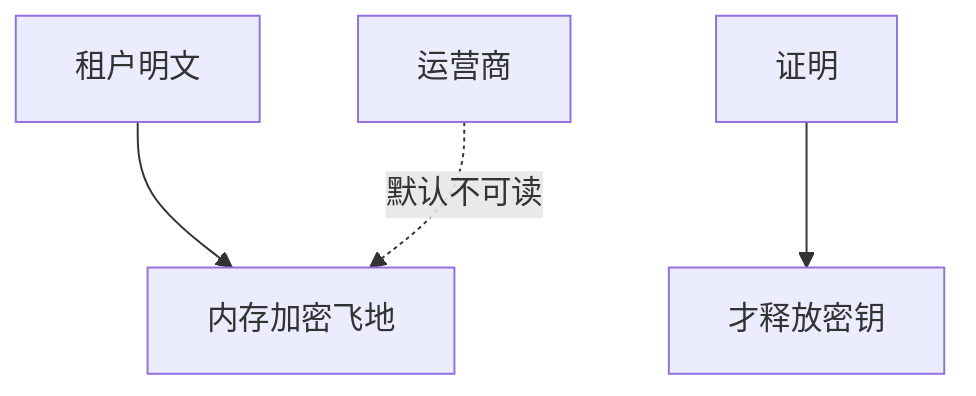
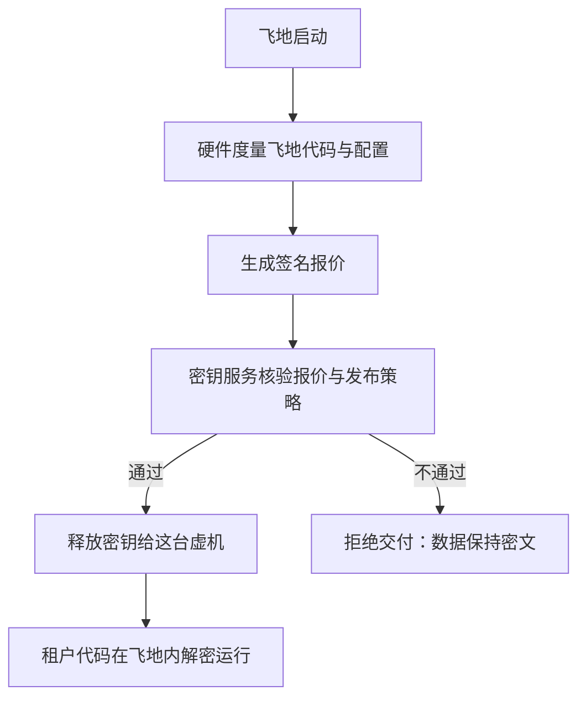

# 机密计算

机密计算承诺：云运营商看不见客户明文内存。实现靠 TEE、内存加密与证明。合同要写清谁是 TCB：CPU 厂商、主机固件、飞地代码。

<footer>—— 据 Confidential Computing Consortium 的定义陈述；对照 Costan–Devadas；NIST 对 TEE 的讨论</footer>

上一课[TEE](/cs/tee-sgx-trustzone)给了硬件盒子；缺口是把它放进**云威胁模型**：运营商的 hypervisor 与管理员是天然的「好奇对手」。本课把产品叙事钉成 TCB 清单，不写打穿步骤。

后课默认已经读完本课钉下的合同，只补差，不从该领域第一性原理重开。

## 问题

静态加密只保护磁盘；数据进入运行中内存后对宿主完全可见——调试接口、内存快照、内部管理员都碰得到。可以类比成在房东家里租了一间带独立锁的保险库：房东（云运营商）照样管水电门禁（资源调度、网络），却打不开你的保险箱（内存密文）；「远程证明」则是保险库开门前先向公证处自证「锁没被换过、图纸没被改」。机密虚拟机的回答是内存加密加飞地隔离：客户页出 CPU 即密文，解密视图只存在于飞地内。缺口是两件：证明（怎么确认自己真跑在飞地里）与密钥释放策略——密钥只在证明通过后交付，失败即不交。

### 不是零泄露

不是零泄露：缓存侧信道、嵌套虚拟化、设备直通的固件都可能漏——合同要写清覆盖哪些轴、不覆盖哪些，不能是营销词。初学者容易把机密计算当成「零泄露」承诺。实际上内存加密只遮住内容，不改变访问时序——攻击者仍能从缓存命中与未命中的时间差里挤出秘密。合同没写覆盖的那根轴，就默认不在保护范围内。

CCC。远程证明下一课专收度量与报价。

## 方法

方法是把 TCB 列成清单：CPU 微码与硅、根信任固件、被削到最小的 VMM（宿主从「可信执行」降级为「只管资源调度」）、客户自己的飞地代码——每一项都是信任对象，出洞即穿。对照 HSM：HSM 把信任缩进一颗卡，机密计算把信任摊到一台主机但收回内存与执行——粒度不同，都要写进合同。下一课远程证明。

```mermaid
flowchart TD
  TENANT["租户明文"] --> TEE["内存加密飞地"]
  HOST["运营商"] -.->|"默认不可读"| TEE
  ATTEST["证明"] --> KEY["才释放密钥"]
```

## 机制

机制定位：这是云上的 C 针对**运营商**——新的保密对象是「宿主也看不见」，而非只防 Internet。内存加密由内存控制器层完成，密钥每虚机一份、随生命周期销毁；证明把「我是真飞地、跑的是这份代码」变成可验证的签名声明，密钥服务按声明放行。侧信道不在本合同内，要另配缓解。下一课远程证明专讲证明。

```mermaid
flowchart TD
  BOOT["飞地启动"] --> MEAS["硬件度量飞地代码与配置"]
  MEAS --> QUOTE["生成签名报价"]
  QUOTE --> VERIFY["密钥服务核验报价与发布策略"]
  VERIFY -->|"通过"| REL["释放密钥给这台虚机"]
  VERIFY -->|"不通过"| DENY["拒绝交付：数据保持密文"]
  REL --> RUN["租户代码在飞地内解密运行"]
```

## 边界

不写逃逸；边界要点名：TCB 清单里最大的一项通常是 CPU 厂商的微码与固件——客户实际在信任厂商的工程与响应流程，这是合同性信任，技术消除不掉。远程证明下一课。

「TCB（可信计算基）」翻译成白话：你信了这个系统，就等于把名单上每个人的诚实与不犯错打包一起信了——CPU 微码、固件、VMM、飞地代码，名单上任何一个出洞，整个承诺就穿了。所以清单越长，承诺越弱；把 VMM 从名单上划掉（降级为只管调度）正是机密计算的主要卖点。

## 小结

- TEE 零件；机密计算是云威胁模型。
- TCB 必须写进合同。
- 密钥释放绑证明。
- 下一课远程证明。
- 出处：Confidential Computing Consortium；Costan and Devadas。
