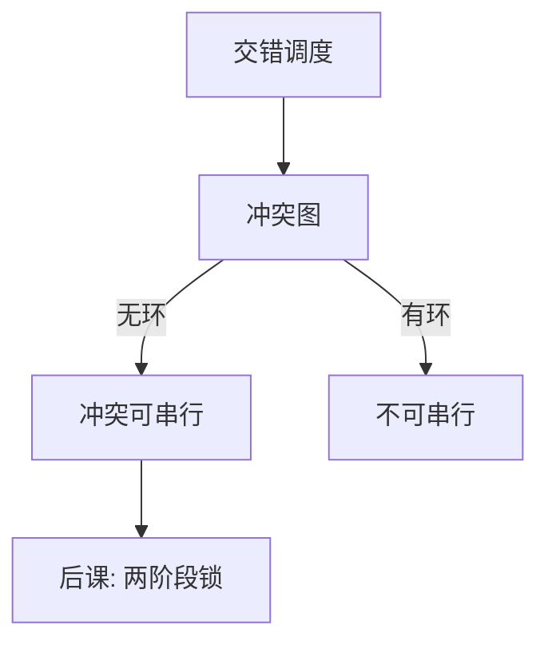

# 冲突可串行

并发调度若能经交换非冲突操作变成某一串行序，则读写结果与「一次一个事务」相容。

<footer>—— 据 Eswaran et al., The Notions of Consistency and Predicate Locks, CACM 1976；Bernstein, Hadzilacos and Goodman</footer>

[上一课](/cs/acid)把隔离列为规格，没有给调度标准。本课不重讲 WAL。缺口是：哪些交错合法。冲突可串行用读写冲突图：若图无环，调度等价于某一串行序。这是后课两阶段锁要保证的对象，不是「把库锁成单线程」。

## 问题

两个事务的读写交错，可能读到对方未提交值，或把对方覆盖掉。串行执行一定满足隔离，但吞吐为零。缺口不是[竞争与临界区](/cs/race-critical)再讲一遍互斥，而是数据库里的对象是数据项上的 r/w，正确性用**冲突等价**定义：只有冲突的一对操作不能交换；能排成串行序则隔离这一档成立。

视图可串行更宽、判定更难；主干用冲突可串行，因为它有多项式判定（判环）。

冲突：同一数据项上至少一写，且分属两事务。rw、wr、ww 三类。无环 ⇔ 存在冲突等价的串行序。

## 方法

把调度写成操作序列。画优先图：事务为顶点，冲突对 $T_i$ 先于 $T_j$ 则加边。无环则拓扑序即一个等价串行序。脏写、读未提交会在图上留下与「提交序」不一致的边，通常直接拒绝或靠锁避免进入这种调度。

## 机制

可串行不等于可恢复：可能先读脏再让写者 abort。恢复性、避免级联回滚是更强的日志向条件，与 ARIES 的 UNDO 相接。本课先钉隔离的代数标准；实现可以产生比冲突可串行更严的调度（如严格两阶段锁）。

幻象：插入使谓词读的结果集变化，项级冲突图看不见。那是谓词锁或后课隔离级别里 phantom 的缺口，本课只点名冲突图以已有数据项为对象。

## 边界

不要把可串行当成「用户看见的顺序就是提交墙钟序」。等价串行序可以与墙钟不同。也不要在本课引入快照隔离的写偏斜——那是 MVCC 与级别课。单对象上的线性化是另一种规格，这里是多对象事务。

提交序可串行（CSR 的加强）把等价串行序钉成提交顺序，实现更贵，规格更贴墙钟。主干先用冲突可串行。后课默认：隔离的尺子先是冲突可串行；锁协议是为了只产生无环调度。

无环是判定，不是实现。运行时不会先画完图再执行；后课 2PL 的作用就是从一开始就不让环长出来。

## 小结

- ACID 的 I 要用调度语言说清；本课用冲突图无环。
- 可恢复性另论；幻象超出项级冲突。
- 如何用锁只产生无环调度，是两阶段锁的缺口。
- 出处：Eswaran et al., 1976；Bernstein, Hadzilacos and Goodman, *Concurrency Control and Recovery*。
