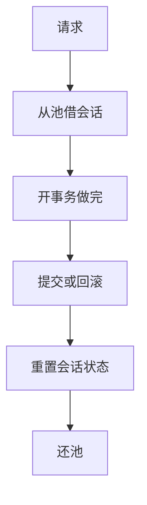

# 连接池

会话在库内是内存、锁与临时状态的所有者；池把建立会话的代价摊到多次请求，但把隔离与事务边界从「连接寿命」里拆出来。

<footer>—— 据 Gray and Reuter 对会话；HikariCP / 数据库手册对池化实践；Ramakrishnan and Gehrke</footer>

[上一课](/cs/orm-impedance)指出对象导航会打出许多语句。本课不修 N+1。缺口是每条语句下面的**会话**：TCP、认证、后端进程或线程、会话级设置。每次请求新建连接，延迟与进程数都会打爆。连接池在应用侧（或中间件）保持一组就绪会话，借出还回。

## 问题

库的并发容量常按连接数计：每个后端有缓冲区、准备语句缓存、可能还有锁。连接数 ≈ 峰值并发请求会让上下文切换与内存爆炸。缺口是复用：池大小、超时、失效检测（后端已死但套接字还在）。事务必须在还池前结束：把打开事务的连接还回去，下一个请求会看见未提交状态或锁——这是正确性 bug，不是性能调参。

会话级状态：`SET`、临时表、顾问锁、未用完的游标。还池必须重置，否则请求之间泄漏。这与 [保存点](/cs/savepoints) 不同：保存点属于事务，池属于会话寿命。

服务器侧也有池（PgBouncer 一类）把许多客户端复用到较少后端。事务模式与会话模式决定临时表能否跨请求。本课把「会话有状态」钉死，模式选择是产品合同。

## 方法

应用池：固定上限、队列或拒绝、空闲逐出、连接校验查询。借出范围 = 一次请求或一次工作单元，与 ORM 会话对齐。只读副本：另一池，避免写事务发到备库却假定可写。

池不能增加库的逻辑并发上限，只减少建立代价并平滑峰值。库侧 `max_connections` 仍是硬顶。

## 机制

预编译语句与会话绑定：有的引擎把计划缓在后端。池稳定后，同一后端反复看到相似语句，后课计划缓存才有命中。连接抖动（频繁新建）则缓存冷。SSL 握手摊销也是池的理由。

线程与连接：一请求一连接简单；异步运行时可能更少连接多路复用协议（若库支持）。本课不把异步驱动当默认模型。

## 边界

本课不讲计划缓存的失效与绑定窥视——下一课。也不把池当限流器的全部：队列过长等于把延迟藏在应用里。分布式事务里每个资源管理器仍要会话，池按库实例分。

后课默认：连接是稀缺会话，事务在还池前关闭，会话状态不泄漏。预编译与计划缓存建立在「同一后端反复出现同一语句形状」上。

池解决的是会话造价，不解决慢查询、不解决阻抗失配。

## 小结

- 池复用会话，上限对齐库容量；还池前必须结束事务并重置状态。
- 服务器侧池化改变临时表与会话语义，要按模式读合同。
- 预编译与计划缓存下一课：形状稳定之后，计划才能留住。
- 出处：Gray and Reuter；Ramakrishnan and Gehrke；池化中间件实践。
