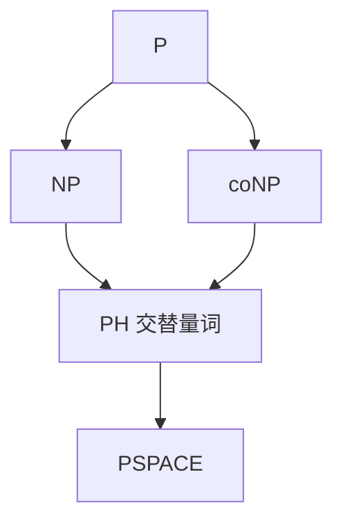

# coNP 与多项式层级

coNP 是 NP 语言的补；多项式层级用交替的多项式长量词给 NP、coNP 搭楼，PH 落在 PSPACE 里。

<footer>—— 据 Stockmeyer；Garey and Johnson；Arora and Barak 整理</footer>

上一课[Cook–Levin](/cs/cook-levin) 把 NP 钉在「存在短证书」。缺口是**否实例**的短证，以及更多量词。coNP：$\overline L\in\mathrm{NP}$。TAUTOLOGY、UNSAT 是 coNP 完全候选。多项式层级 $\Sigma_k^p,\Pi_k^p$：交替 $\exists\forall$ 各多项式长。$\mathrm{NP}=\Sigma_1^p$，$\mathrm{coNP}=\Pi_1^p$。$\mathrm{PH}\subseteq\mathrm{PSPACE}$。

## 问题

「无哈密顿回路」不像有短 Yes 证书。若 $NP=\mathrm{coNP}$，层级会塌。若任一 $\Sigma_k^p$ 完全问题落到下一层，PH 塌缩。本课不裁决塌缩，只给量词形状。$\Pi_2$ 例：$\forall$ 对手策略 $\exists$ 我的应对（某些博弈的短局）。TQBF 不限制量词个数，故在 PSPACE 而不必在 PH 的固定层。

主干只谈 $P$ vs $NP$。本课把第三轴 coNP 插上，避免把「难」全写成 NPC。

### coNP 不是「补算法」

$P$ 对补封闭：把是/否翻转。NP 未知。证书对 Yes 短，不自动给 No 短证。UNSAT 的短证若存在且易验，则 $NP=\mathrm{coNP}$ 一类结论，未被证明。

Stockmeyer 的多项式层级。Garey–Johnson 讨论 coNP。Arora–Barak 第 5 章。本课不引入预言机塌缩的全部相对化。

## 方法

写 $\Sigma_2^p$：存在多项式 $u$，对所有多项式 $v$，某 P 谓词 $R(x,u,v)$。指出 PH 的完全问题（带 $k$ 个量词的 3SAT 变体）点名即可。画包含图：$P\subseteq NP\cap coNP\subseteq NP\subseteq PH\subseteq PSPACE$。

## 机制

量词个数对应交替图灵机的交替次数。Savitch 把空间非确定平方掉，管不到量词交替的时间类。若 $P=NP$ 则 PH $=P$。故「只证了 NP 完全」之后，层级问题仍然在。

不要把 coNP 完全当成「比 NPC 更难」：它们是不同方向的完全，未知谁包含谁。

若 $NP=\mathrm{coNP}$，则 PH 塌到第二层以下（实际上到 $NP$）。$\Sigma_2$ 完全问题的脸谱是「存在电路使某 SAT 公式恰有某种计数性质」一类，本课不列清单。交替图灵机的交替次数对应层数；PSPACE 允许多项式次交替，故 TQBF 不必停在固定 $k$。

## 边界

本课不证 Toda 定理，不引入 $\mathrm{PH}\subseteq P^{\#P}$。不把 $\Sigma_2$ 电路下界提前。后课默认：Yes 短证是 NP，No 短证是 coNP；更多交替是 PH。下一课硬币：BPP。

量词个数固定的层级与 PSPACE 的「任意多项式个量词」之间仍可能有缝。$P=NP$ 会把整栋 PH 压成 $P$。不要把 coNP 完全说成「比 NPC 更难」——方向不同。

## 小结

- coNP = NP 的补类；UNSAT 是典型对象。
- PH 是多项式长交替量词；$PH\subseteq PSPACE$。
- 塌缩开放；$P=NP$ 会把整栋楼压扁。
- 出处：Stockmeyer；Garey and Johnson；Arora and Barak。
