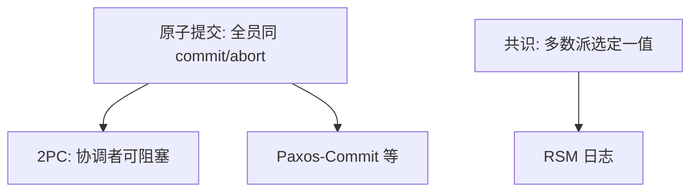

# 共识与 2PC

两阶段提交让所有资源管理器同提交或同中止，但协调者崩溃会阻塞。共识复制的是决策日志，换主可以继续；2PC 复制的不是那条日志。

<footer>—— 据 Gray and Reuter, Transaction Processing；Lamport, Paxos Made Simple；Skeen, Nonblocking Commit Protocols 整理</footer>

上一课[PBFT](/cs/pbft)把法定人数决策做到撒谎档。缺口是**事务提交协议常被误叫共识**：2PC 的参与者对「commit/abort」要一致，但经典 2PC 有单点阻塞，不满足[FLP](/cs/flp-impossibility)语境下「正确节点终决定」——它根本没打算在协调者死时终止。本课拆开。不重写 prepare/accept。

## 问题

2PC：协调者问 canCommit，全部是则 commit，否则 abort。参与者在准备后进入不确定态，必须等协调者。协调者在发出 commit 前崩溃：参与者阻塞。这是原子提交，规格是「全员同结果」，假设是崩溃恢复+最终协调者回来或人工。

共识（Paxos）：多数派活着即可选定值，少数派阻塞不影响已选定值的学习者。缺口：原子提交在存在故障时有已知困难（Skeen 非阻塞提交需要更多轮与更多活节点假设）。把 2PC 当 Paxos 会在协调者死时把整个事务卡住，还以为「有共识」。

Gray 的事务教材把 2PC 当恢复协议。Paxos-Commit 一类工作用共识选 commit/abort，消除单协调者阻塞，那是混合，不是经典 2PC。

## 方法

需要跨分片原子：要么阻塞式 2PC（短事务、协调者高可用），要么把提交记录写进[RSM](/cs/replicated-state-machine)（协调者本身是多数派）。需要给配置/锁一个值：直接共识，不要 2PC。

3PC 减少部分阻塞，在异步网络仍有坑；本课点名，不展开状态表。

## 机制

2PC 的「多数」不是法定人数相交：它要**全体**准备成功才提交，一个慢盘就能中止或拖死。共识的多数是为了在 $f<n/2$ 崩溃下仍选定。对象不同：2PC 对象是事务结局；Paxos 对象是槽里的字节。

数据库课的事务与 WAL 仍在：2PC 是跨资源管理器的补丁。分布式课到这里才把它和复制日志分开，避免「我们用了 2PC 所以线性一致」——2PC 不给寄存器线性一致，只给参与者原子结局，且可阻塞。

本课不重写隔离级别。也不把 Saga 补偿当 2PC（后课系统模式）。

## 边界

本课不画 2PC 全部超时状态。不引入 XA 接口清单。后课默认：阻塞原子提交 ≠ 共识；要故障下仍前进，把决策放进 Paxos/Raft 日志。领导者选举下一课处理「谁当协调者/主」的脑裂，那是另一坑。

全员同意比多数派同意更脆。脆的协议不能靠改名变强壮。

## 小结

- 2PC：原子提交，协调者崩溃阻塞。
- 共识：多数派选定值，换提议者可继续。
- 高可用提交 = 用共识复制 commit 决策，不是裸 2PC。
- 出处：Gray and Reuter；Lamport 2001；Skeen 非阻塞提交。
