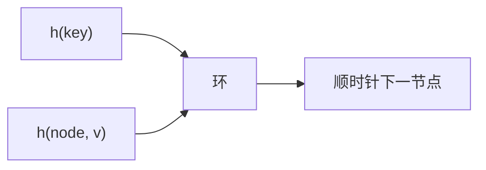

# 一致性哈希

机器与键都映射到环上；键跟顺时针第一台机器。加一台只动邻近弧上的键，不是全表 $\bmod n$。

<footer>—— 据 Karger, Lehman, Leighton, Panigrahy, Levine and Lewin, Consistent Hashing and Random Trees, STOC 1997；Karger et al. 后续 Web 缓存文献整理</footer>

[上一课](/cs/perfect-hashing) 钉死静态槽。[通用散列](/cs/universal-hashing) 的 $m$ 一变，$h(x)\bmod m$ 几乎所有键换家。缓存集群、分片要的是**扰动最小**。本课不造 FKS 二级表。缺口是一致性哈希：环 + 虚拟节点。

## 问题

$n$ 台机器，$\bmod n$ 在 $n\to n+1$ 时期望几乎全部键迁移。一致性：键、节点都哈希到 $[0,1)$ 环（或 $2^{w}$），键归属顺时针下一节点。新节点只接管它到前驱之间的弧。期望每键迁移比例 $\Theta(1/n)$。缺口不是完美无碰撞，而是**映射随节点集平滑变化**。

Karger et al., *STOC*, 1997。虚拟节点：每机多个环上位置，改善负载方差。Rendezvous / 跳跃哈希是亲戚，本课点名。

## 方法

查找：对键哈希，在有序节点环上后继（树或跳表）。增删节点：插/删环上点，只迁移受影响键。虚拟节点数 $v$ 权衡均匀与元数据。权重机可按权重复制虚点。

与 Count-Min：一致性解决放置；草图解决近似计数。不要在本课写限价簿分片。

## 机制

负载：无虚点时单机弧长方差大；虚点使弧更碎。哈希仍建议通用或密码学视对抗模型。故障：节点消失，弧并到后继，与「加节点」对偶。

后课近似结构假定流或多重集，不再假设能存全体键。

## 边界

本课不把 Dynamo 论文当词条抄。不保证全局最优平衡（那是负载均衡另一层）。草图从 Count-Min 开始允许误差。

后课默认：集群成员变化用一致性哈希减迁移。流上近似频次用 Count-Min。

## 小结

- 一致性哈希：环上后继，增删只动邻近键。
- 虚拟节点改善平衡。
- 下一课用草图近似计数，不存键。
- 出处：Karger et al., *STOC*, 1997。
