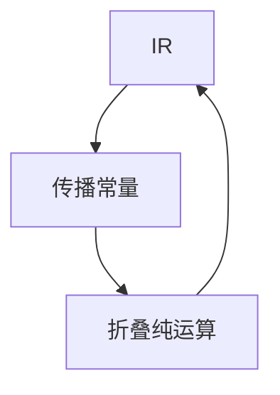

# 常量传播与折叠

若到达此处的定值都是同一常量，则用该常量替换；折叠把纯运算在编译期算完。二者改 IR，不改语言的操作语义约定。

<footer>—— 据龙书常量传播；Wegman and Zadeck 前的简单迭代；Appel, Modern Compiler Implementation 整理</footer>

上一课[空与 Option](/cs/null-option)把类型单元收到显式测试。中端第一课：主干已有[到达定义](/cs/reaching-def)、[SSA](/cs/ssa-form)。缺口是**用已知常量改写**：传播把名换成数，折叠把 `2+3` 变成 `5`。本课钉简单迭代与 SSA 上的替换；条件分支上的「半格」留给下一课 SCCP。

## 问题

到达定值给出「哪些写能到这里」。若全部写是 `x=3`，则读 $x$ 可改成 `3`。折叠：运算符无副作用则编译期求值。缺口是**替换的合法性**，不是再定义 CFG。

必须保持[操作语义](/cs/operational-semantics)：浮点折叠受 IEEE 与后课 fast-math 约束；除零不能随便折。Option 的 `Some 3` 可折匹配，`None` 枝可变成死代码——下一课 ADCE。

### 折叠不是预处理器

cpp 的常量是记号层；此处是 IR 层，经过类型与地址计算。不要用 `#define N 4` 当本课定义。

龙书 9.4。Appel 在 SSA 上把传播写成替换。Kildall 的数据流格是背景。本课简单格：⊤/常量/⊤冲突为全⊤。

## 方法

非 SSA：迭代数据流，格元素为「非常量 / 某常量 / 未定义」。SSA：φ 的操作数全同则 φ 成常量；否则该名非常量。折叠在替换后立即做，可能露出新常量。

与[抽象解释](/cs/abstract-interpretation)：平坦常量域是 AI 特例，加宽在此不必，因高度为 2。

## 机制

副作用：`++`、调用、volatile 不折。别名：存内存的「常量」要等别名分析——后课。本课先标量 SSA 名。

不要折 `x/x` 为 1 当 $x$ 可能为 0，除非语言 UB 允许——[UB 与优化](/cs/undefined-behavior-opt) 再收。

## 边界

本课不写稀疏条件传播。后课默认：标量常量可在 SSA 上替换。下一课 SCCP：把分支条件也推进格。

也不把常量传播当过程间内联的替代。

## 小结

- 传播：到达处唯一常量则替换；折叠：纯运算编译期求值。
- SSA 上是替换；格冲突则放弃。
- 副作用与浮点规则限制折叠。
- 出处：Aho et al. 龙书；Appel；对照 Cousot 平坦域。
