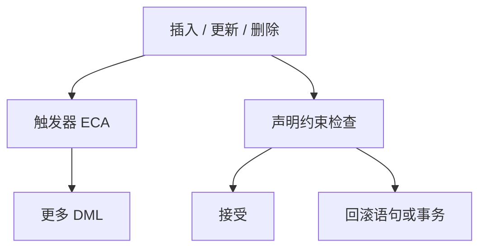

# 约束与触发器

约束是声明的不变式，拒绝违反它的状态；触发器是事件上的过程，能维护、能通知，也能把语义藏进过程体。

<footer>—— 据 Codd 完整性；Widom and Finkelstein 主动数据库；Gray and Reuter；Ramakrishnan and Gehrke</footer>

[上一课](/cs/outer-semi-join)把读侧的连接族补齐。本课不重讲 NULL 填充。缺口是**写路径上的含义**：键、外键、检查条件如何在语句边界成立，以及触发器如何在插入更新删除时自动开火。主干 [键与完整性](/cs/keys-integrity)、[外键动作](/cs/fk-actions) 已给声明约束；进阶对照过程式触发器，避免把两者混成「都是规则」。

## 问题

声明约束：主键、唯一、外键、`CHECK`、`NOT NULL`。引擎在 DML 后（或延迟到提交）检查，失败则语句或事务失败。这是不变式，优化器有时还能用约束改写查询（唯一则基数至多一）。缺口是：有些维护写不进约束——写审计行、同步冗余列、级联之外的业务。触发器绑定事件（BEFORE/AFTER、行级/语句级），过程体再写 SQL 或过程语言。

主动数据库把规则写成「事件–条件–动作」（ECA）。触发器是工程落地。危险是递归触发、顺序依赖、与约束检查的交错顺序因产品而异。本课钉分类，不背每家手册。

延迟约束：可先插入互相引用的两行，提交时再查外键。触发器通常不能「延迟到提交才想起来语义」而不留下中间可见状态——可见性仍受隔离级别约束。

## 方法

约束：模式对象，查询优化可假设它们永真。触发器：过程，优化器一般看不见体内部的代数。维护冗余（如缓存合计）可用触发器，也可用后课物化视图刷新；前者灵活，后者有机会增量计划。

级联外键是声明动作，不是触发器；实现上可能走同一套内部触发机制，对用户仍应是约束语义。本课不把内部实现当用户模型。

## 机制

检查时机：立即约束在语句末；延迟在提交。触发器嵌套时，约束可能看到触发器造成的中间行。写偏斜一类异常仍是并发课的对象；约束不自动给出可串行。

失败处理：约束失败有标准的事务后果；触发器里自己吞掉错误会破坏「不变式总成立」。主干把声明约束当默认完整性通道，触发器当无法声明时的补充。

## 边界

本课不讲存储过程的模块系统、包与权限模型——下一课存储过程。也不把触发器当消息总线或跨库工作流。递归深度限制是产品参数，不是理论原语。

后课默认：能写成约束的不要藏进触发器。触发器有副作用，去相关与下推都把它们当防火墙。保存点与过程体里的部分回滚是再下一课。

完整性首先是模式上的断言。过程是补充，不是另一套关系理论。

## 小结

- 约束声明不变式；触发器是 ECA 过程，优化器通常看不见。
- 级联外键是声明动作；延迟约束在提交时检查。
- 存储过程下一课：可调用的过程模块，不只绑在事件上。
- 出处：Codd；Widom and Finkelstein；Gray and Reuter；Ramakrishnan and Gehrke。
