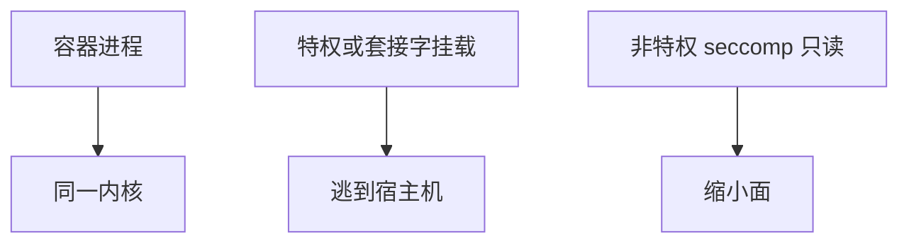

# 容器逃逸

容器用命名空间与 cgroup 切片同一内核。逃逸常走挂载、特权、有缺陷的系统调用或运行时。比 VM 更轻，也更依赖内核正确与禁止特权容器。

<footer>—— 据 Linux namespaces/cgroups 文档；OCI 运行时规范；对照[隔离与沙箱](/cs/isolation-sandbox)</footer>

## 定位

上一课[VM 逃逸](/cs/vm-escape)有独立内核。缺口是**共享内核的薄盒**。本课讲运行时合同：非特权、只读根、seccomp，不给逃逸步骤。

后课默认已经读完本课钉下的合同，只补差，不从该领域第一性原理重开。

## 问题

--privileged、docker.sock 挂载、旧 runc。缺口是：默认非特权、只读、用户命名空间、最小镜像。

### K8s

Pod 安全策略与准入是同一合同的编排层。

runc CVE 仅作窗口点名。禁止逃逸教程。隐私单元下一课从差分隐私起。

## 方法

对照 VM。列出禁止项。系统与硬件课序封口，下一课序隐私。

图中节点是本课的机制骨架；课程不把图展开成可运行的攻击步骤。

## 机制

薄隔离要更严的默认。隐私课序问数据发布而非逃逸。

前提写进合同之后，游戏外的误用只当失败模式点名，不在本课写成操作程序。

## 边界

零逃逸配方。下一课序差分隐私。

## 小结

- VM 有客核；容器共享内核。
- 特权与运行时套接字是经典面。
- 默认非特权加 seccomp。
- 下一课序：差分隐私。
- 出处：Linux namespaces；OCI；[isolation-sandbox](/cs/isolation-sandbox)。
