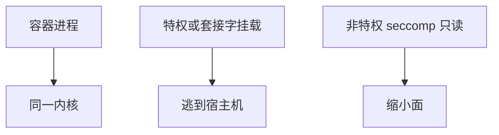
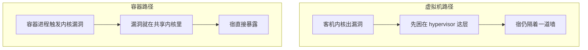

# 容器逃逸

容器用命名空间与 cgroup 切片同一内核。逃逸常走挂载、特权、有缺陷的系统调用或运行时。比 VM 更轻，也更依赖内核正确与禁止特权容器。

<footer>—— 据 Linux namespaces/cgroups 文档；OCI 运行时规范；对照[隔离与沙箱](/cs/isolation-sandbox)</footer>

上一课[VM 逃逸](/cs/vm-escape)里的客机至少有独立内核；本课缺口是**共享内核的薄盒**——容器与宿主机跑同一个内核，隔离只靠命名空间与 cgroup 这层软件切片。本课讲运行时合同：非特权、只读根、seccomp，不给逃逸步骤。

后课默认已经读完本课钉下的合同，只补差，不从该领域第一性原理重开。

## 问题

容器的经典暴露面：--privileged 关掉全部防护；把宿的 docker.sock 挂进容器等于把宿的管理权递进去；旧版 runc 的漏洞是运行时自身的窗口。缺口是四件默认：容器默认非特权（裁掉 capability）、根文件系统只读、启用用户命名空间把容器 root 映射成宿上的普通用户、镜像最小化少带可利用代码。

### K8s

K8s 层面是同一份合同的编排化：准入控制（原 Pod 安全策略，今 Pod Security Standards）把「禁特权、禁宿路径挂载」变成集群级强制，不靠每个开发者自觉。

runc CVE 仅作窗口点名。禁止逃逸教程。隐私单元下一课从差分隐私起。

## 方法

方法先对照 VM：VM 的 TCB 是 hypervisor，容器的 TCB 是整个内核——面大得多，默认就必须更严。禁止项清单：特权容器、宿 docker.sock、hostPath 挂载、CAP_SYS_ADMIN；配 seccomp 白名单与 AppArmor/SELinux。系统与硬件课序在此封口，下一课序隐私。

TCB（可信计算基）就是「安全成立所依赖的全部代码」的清单：清单里任何一行出漏洞，隔离承诺就跟着破。VM 的清单是 hypervisor 那几十万行；容器的是整个 Linux 内核两千多万行——清单长了几十倍，这就是容器默认必须更严的算术原因。

```mermaid
flowchart TD
  CTR["容器进程"] --> KERN["同一内核"]
  PRIV["特权或套接字挂载"] --> ESC["逃到宿主机"]
  POL["非特权 seccomp 只读"] --> LIM["缩小面"]
```

## 机制

机制一句话：薄隔离必须配更严的默认——隔离层越薄，越没有余量吸收配置错误，容器因此是「默认拒绝再加例外」，与 VM「默认放行再收紧」方向相反。内核漏洞是这个模型的硬边界：共享内核意味着内核 0-day 时容器与宿同沉浮，这正是 gVisor 一类用户态内核与微虚机存在的理由。隐私课序问数据发布而非逃逸。

```mermaid
flowchart TD
  subgraph VMP["虚拟机路径"]
    G["客机内核出漏洞"] --> HYP["先困在 hypervisor 这层"]
    HYP --> R1["宿仍隔着一道墙"]
  end
  subgraph CTP["容器路径"]
    P["容器进程触发内核漏洞"] --> K["漏洞就在共享内核里"]
    K --> R2["宿直接暴露"]
  end
```

直觉类比：VM 是每户一栋独立小楼，楼与楼之间是护城河（hypervisor）；容器是同一栋楼里用隔断墙隔出的房间。隔断（命名空间）做得再精致，地基（内核）一塌，所有房间一起塌——gVisor 一类方案相当于给房间自建一个假地基。

## 边界

零逃逸配方；边界要点名：seccomp 与只读根防的是容器攻宿，不防容器之间互打——跨租户还要网络策略与每工作负载的身份。下一课序差分隐私。

常见误区：配好 seccomp、只读根、非特权，就容易以为「这台容器已经攻不破」。实际这套合同只防「容器攻宿」这一个方向；两个容器之间互打走的是网络与身份，要另配网络策略和每负载身份，漏配这层，横向移动照样发生。

## 小结

- VM 有客核；容器共享内核。
- 特权与运行时套接字是经典面。
- 默认非特权加 seccomp。
- 下一课序：差分隐私。
- 出处：Linux namespaces；OCI；[isolation-sandbox](/cs/isolation-sandbox)。
