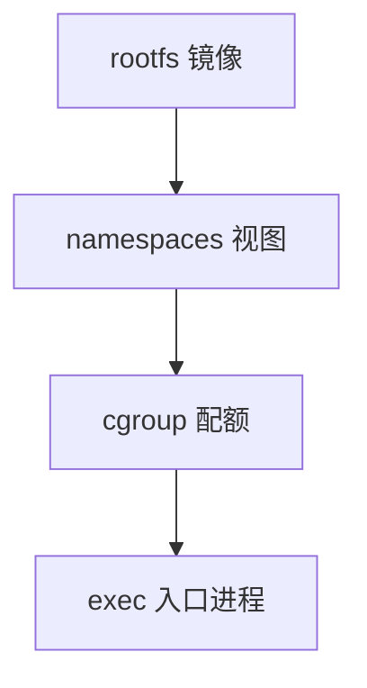

# 容器的 OS 含义

容器不是第二台内核：它是命名空间中的视图、cgroup 中的配额，加上一个用户空间根文件系统。

<footer>—— 据 Linux 容器相关文档；Tanenbaum 对虚拟化与容器对照的整理</footer>

[上一课](/cs/cgroups)给了配额，[namespaces](/cs/namespaces) 给了视图。[init](/cs/init-userspace) 可以在 pid 空间里再跑一个 1 号。[VFS](/cs/vfs) 的绑定挂载把主机目录接到容器根。缺口是**收束定义**：工程上的「容器」= 这些 OS 原语的打包，对比下一课才开始的真虚拟机（客内核）。

## 问题

若把容器说成轻量虚拟机，会误以为有独立页表根与独立中断。实际上：同一 [用户/内核分裂](/cs/user-kernel-split)，同一系统调用表，除非再加过滤。隔离强度弱于 VM：内核漏洞是共享的。收益是启动快、密度高、不模拟设备。缺口：讲清打包（镜像只是 rootfs + 元数据），运行时负责 clone 标志、cgroup 路径、网卡进 net ns。本课不写编排器。

seccomp、capabilities、只读挂载是常见加固，下一课专讲系统调用过滤。本课不给逃逸清单。

## 方法

运行时：`clone` 新 ns、配 cgroup、pivot_root 到镜像、exec 入口。网络：veth 一对进 net ns，外层接网桥——链路层细节留给网络课，这里只承认「另一份网络栈视图」。存储：overlay 等联合挂载是 VFS 功能，不是新内核。

## 机制

容器把本 OS 课从进程到挂载的对象组合起来，而不引入客机页表。它解释了为何「容器里 cat /proc/cpuinfo」仍是主机 CPU：没有 trap-and-emulate。下一课缩小系统调用面；再下一课才是真正的敏感指令陷入。

与过度提交、页 Cache 共用主机内存：cgroup 只是上限。

## 边界

本课不引入 gVisor 等用户态内核。不把 OCI 规范当必背。下一课：即便 ns 切了，系统调用号仍通到同一内核——用过滤器裁面。

后课默认：容器共享内核。按系统调用号拦截，下一课 seccomp。

## 小结

- 容器 = namespaces + cgroups + 用户态 rootfs，共享内核。
- 不是客机，没有独立特权 ISA 视图。
- 系统调用过滤是 seccomp 的缺口。
- 出处：Linux namespaces/cgroup 文档；Tanenbaum *MOS*。
