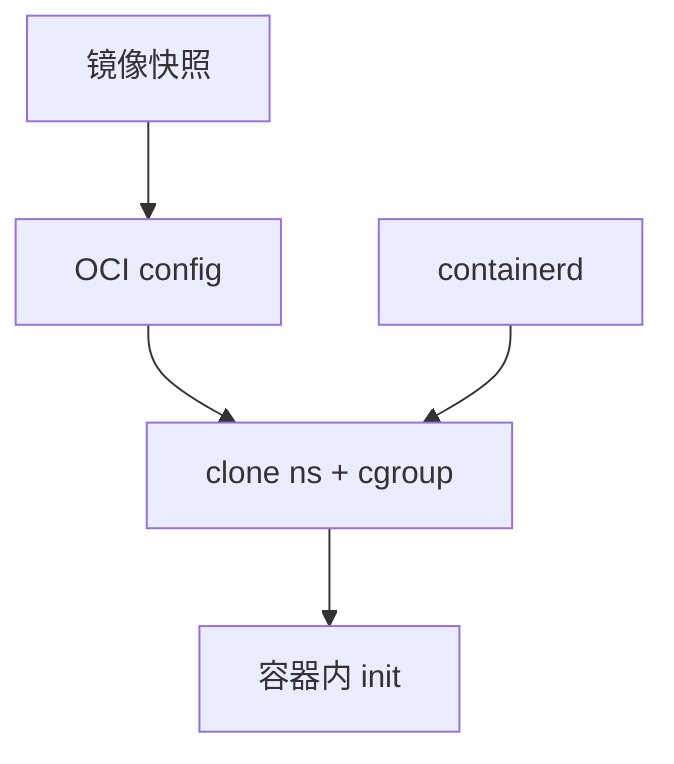

# runc 与 containerd

runc 按 OCI 配置把进程放进命名空间与 cgroup；containerd 管镜像、监督、shim，真正的隔离仍是内核原语。

<footer>—— 据 OCI Runtime Spec；containerd 文档；[namespaces](/cs/namespaces) 与 [cgroups](/cs/cgroups) 为先修</footer>

[上一课](/cs/nested-virtualization)是套 VM。[overlay](/cs/overlayfs) 已有层。缺口是 **运行时**：runc 如何 `clone`，containerd 如何盯着它。不是 Docker 产品史。

## 问题

OCI config.json：rootfs、ns、cap、mount。runc：创建 ns、写 cgroup、exec 用户 pid 1。containerd：拉镜像、快照、调 runc、shim 收 SIGCHLD。缺口：与 [systemd](/cs/systemd-units) cgroup 驱动；与 [netns veth](/cs/netns-veth)。本课不把 k8s CRI 写成编排课。

shim 让 daemon 升级不杀容器。对象是用户态拼内核隔离，不是新内核。

## 方法

unpack 层到 overlay → 生成 spec → runc start。对照 [QEMU](/cs/kvm-qemu)：一个进 VMX，一个进 ns。对照 [FUSE](/cs/fuse)：rootfs 通常是普通 FS。对照 LSM：可带 SELinux 标签。

## 机制

容器运行时把已有内核隔离收成可复现的 JSON，使打包与云调度成为可能。安全等于内核+配置，不是 runc 魔法。不要写成 Docker 教程。与 [capabilities](/cs/linux-capabilities)：spec 里 drop。与 [memcg](/cs/memcg)：这里落地。

逃逸往往是内核漏洞或错误特权，不是「容器不是 VM」口号能挡的。

实现上：spec 里的 mounts 把 proc/sys 以安全选项挂上，漏了就会看到宿主。shim 的父进程若是 containerd，升级 daemon 不杀容器。cgroup 路径决定统计落在哪。 读法上只引用[上一课](/cs/nested-virtualization)的结论，不把对象换成训练推理或限价簿。

本课在操作系统进阶的「虚拟化与隔离进阶 / 容器与内核形态」课序里，对象是 **runc 与 containerd**。

- 先修只引用，不重导：上一课的结论当公理，本课只补差。
- 五栏不吞并：不把本课写成大模型训练/推理，也不写成限价簿或权重量化。
- 文献用 OSTEP、McKusick、内核文档与具名会议论文；不发明 arXiv 编号。

## 边界

本课不引入所有 runtime hook。不保证 Windows 容器。下一课镜像层格式。

版本字段会变，课序钉的是机制对象「runc 与 containerd」，不是某一主线内核的结构体名。
后课默认：runc 用 ns/cgroup 启进程。OCI 层如何叠，下一课。

## 小结

- runc 应用 OCI spec；containerd 管镜像与监督。
- 隔离来自内核，运行时只拼装。
- OCI 镜像层是下一课。
- 出处：OCI runtime；containerd；namespaces。
