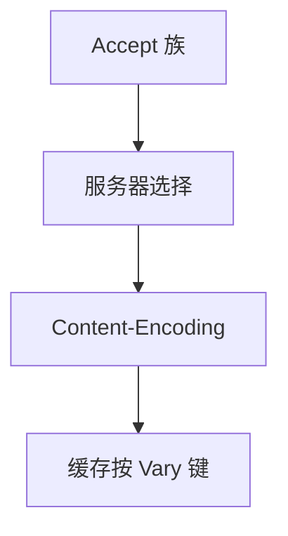

# 内容协商与压缩

Accept 头让客户端声明能懂的媒体类型、语言与编码；服务器挑表示，Content-Encoding 可 gzip，缓存必须 Vary。

<footer>—— 据 RFC 9110 内容协商；RFC 9112 传输编码对照；RFC 1952 gzip 整理</footer>

[上一课](/cs/cookies-sessions) 的头已影响缓存。主干[缓存头](/cs/http-semantics) 未展开协商。缺口是 **Accept\* 与压缩**：表示选择、`Vary`、与 chunked 的分工。本课不把 WebSocket 写完。

## 问题

同一 URI 可有 JSON/HTML、中英、gzip/br。协商：客户端权重，服务器选或 406。压缩减带宽，CPU 换 $C$ 上的头税；已加密的图片再 gzip 无益。`Content-Encoding` 是表示的一部分，`Transfer-Encoding` 是跳上的（1.1 chunked），H2/H3 不用 TE。中间缓存若忽略 `Vary: Accept-Encoding` 会把 gzip 给不能解的客户。

不要把压缩写成线路码 8B/10B。

RFC 9110 第 12 章。Brotli/zstd 是编码登记问题。本课不调压缩级别。

### 压缩要 Vary

Accept 选表示；Content-Encoding 属表示，不是 1.1 的 TE。已压缩媒体再 gzip 无益。加密信道上压缩有历史风险。

## 方法

画：Accept → 选表示 → 可选压缩 → Vary。对照：传输层 TSO 不看媒体类型。与 PMTUD 无关直接，但压缩后长度变，影响是否分块。

方法止于选定对象与对照；机制才说它如何嵌入已有分层与主干课。

## 机制

CDN 要按 Vary 键存多份，否则省的带宽变成错页。QUIC 0-RTT 的协商头也可重放。语言协商与 GeoDNS 后课可叠加。安全：压缩与加密同用有 CRIME 一类历史，TLS 上谨慎压缩。

chunked 与 gzip 常叠：先压缩再分块。

## 边界

本课不引入内容编码登记的全部 IANA 表。WebSocket 是下一课。后课默认：协商选表示；压缩要 Vary。

强制只 gzip 而不看 Accept-Encoding 会破坏老客户。

上一课留下的缺口在本课收口；「内容协商与压缩」进入后课词汇表后只引用。文献用来钉对象与边界，不把本课写成该主题的独立综述。下一课[WebSocket](/cs/websocket)。

## 小结

- Accept 驱动表示选择。
- Content-Encoding 属表示；要 Vary。
- 与 1.1 传输编码不是一层。
- 后课只引用本课钉死的对象，不从该领域总问题重开。
- 出处：RFC 9110；gzip RFC 1952。
