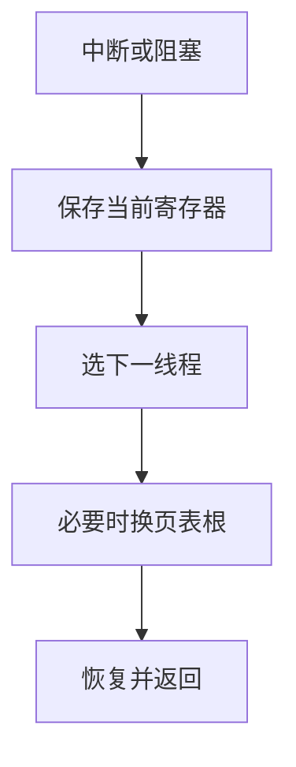

# 上下文切换

切换的代价是保存与恢复寄存器、切换内存映像，以及刷新各种缓存；它不是免费的。

<footer>—— 据 Silberschatz et al., Operating System Concepts 整理</footer>

[上一课](/cs/clone-flags)给出多条可运行的控制流。[异常与中断入口](/cs/exception-interrupt-entry)已经会在陷入时保存 PC。缺口是：内核不仅要进一次入口，还要把 CPU **交给另一条线程**，再从那条线程的入口看起来像从未离开。本课只钉保存什么、换什么。

## 问题

时钟中断或线程主动阻塞时，当前寄存器仍是旧线程的。若不写入控制块就去跑别人，回来时栈指针已经错。跨进程时还要换页表根，否则下一线程用的虚地址会落到旧页上。缺口不是再讲特权环，而是一次**上下文切换**：内核栈上的陷入帧 + PCB/TCC 里的其余状态 + 可选的地址空间。

本课不解释为何选中某一线程，那是调度；也不把系统调用参数拷贝写完，那是下一课路径。

切换计入内核时间。流水线与 TLB、Cache 的热度都会冷掉，所以「可运行线程很多」并不线性加速。

## 方法

在内核态：保存通用寄存器与 PC 到当前线程控制块；选中下一线程后，若地址空间不同则装入新的页表根并处理 [TLB](/cs/tlb-translate)；切换内核栈指针；恢复目标寄存器，返回用户态或留在内核（内核线程）。同进程线程可跳过换根。

硬件上下文（FPU/向量）可以懒保存：直到真正被另一线程使用再换，本课承认有这笔账，不写具体 ABI。

## 机制

对用户线程，切换必须发生在内核态：用户不能自己改页表根。看起来像「这条线程睡着、那条醒来」，其实是同一 CPU 换了一套映像。[流水线异常](/cs/pipeline-exception)要求陷入时精确；切换复用那套保存下来的架构状态，不另造一套寄存器含义。

阻塞与抢占都走同一条保存路径。区别只在于谁引发陷入：`sleep` 是自愿，时钟是非自愿。调度指标下一课才出现。

## 边界

本课不引入用户级无内核切换的协程实现细节，不把 NUMA 亲和与 CPU 热插拔写进主干。也不把「一次切换多少微秒」当成定律：取决于寄存器组大小与缓存。安全课的隔离会关心「有没有漏存」，本课假定保存是完整的。

后课默认：CPU 上任何时刻至多一条线程的用户寄存器是活的；其余在控制块里。用户如何主动进入这条路径请求服务，下一课讲系统调用。

## 小结

- 上下文切换保存寄存器，必要时换页表根，再恢复另一线程。
- 同进程可免换根；跨进程要处理 TLB。
- 选谁运行是调度的缺口；怎么陷入请求是系统调用的缺口。
- 出处：Silberschatz et al., *OSC*；Tanenbaum and Bos, *MOS*。
